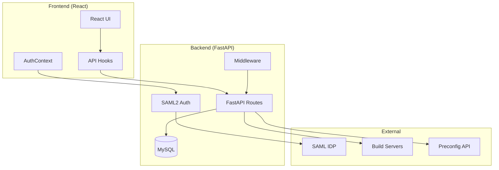

# Server Building Dashboard Documentation

Welcome to the Server Building Dashboard documentation. This system provides real-time monitoring of server builds, preconfiguration management, and server assignment across multiple data center regions.

## Quick Links

| Section | Description |
|---------|-------------|
| [Getting Started](getting-started/README.md) | Installation, configuration, and quick start guides |
| [Architecture](architecture/README.md) | System design, frontend/backend structure, data flow |
| [API Reference](api/README.md) | Complete API documentation with examples |
| [Features](features/README.md) | Feature guides and user workflows |
| [Deployment](deployment/README.md) | Docker, production, and Nginx deployment |
| [Security](security/README.md) | Authentication, permissions, and hardening |
| [Development](development/README.md) | Developer guides and contribution info |
| [Troubleshooting](troubleshooting/README.md) | Common issues and debugging |

## Overview

The Server Building Dashboard is a fullstack monorepo application for monitoring and managing server builds across multiple data center regions (CBG, DUB, DAL).



## Technology Stack

### Frontend
- **React 18** - UI framework
- **TypeScript** - Type-safe JavaScript
- **Vite** - Build tool and dev server
- **Tailwind CSS** - Utility-first styling
- **React Router v7** - Client-side routing
- **Lucide React** - Icon library

### Backend
- **Python 3.11** - Runtime
- **FastAPI** - Web framework
- **SAML2** - Authentication (python3-saml)
- **SQLAlchemy** - ORM (async)
- **MySQL** - Database
- **Pydantic** - Data validation

### Infrastructure
- **Docker** - Containerization
- **Docker Compose** - Multi-container orchestration
- **Nginx** - Reverse proxy (production)
- **Gunicorn + Uvicorn** - Production ASGI server

## Key Features

| Feature | Description |
|---------|-------------|
| **Build Overview** | Real-time visualization of servers currently building across all racks |
| **Preconfig Management** | View, push, and track server preconfigurations to build servers |
| **Server Assignment** | Assign completed servers to customers with audit trail |
| **Build Logs** | Search and view detailed server build logs |
| **SAML Authentication** | Enterprise SSO with Azure AD/ADFS support |
| **Region-Based Permissions** | Fine-grained access control per data center |

## Supported Regions

| Region | Code | Depot ID | Location |
|--------|------|----------|----------|
| Cambridge | `cbg` | 1 | UK |
| Dublin | `dub` | 2 | Ireland |
| Dallas | `dal` | 4 | USA |

## Getting Started

The fastest way to get started is with Docker Compose:

```bash
# Clone the repository
git clone <repository-url>
cd server-building-dashboard

# Copy environment files
cp .env.example .env
cd backend && cp .env.example .env && cd ..

# Start all services
./docker.sh prod start

# Services available at:
# Frontend: http://localhost:8080
# Backend:  http://localhost:8000
```

See [Getting Started](getting-started/README.md) for detailed installation options.

## Documentation Structure

```
docs/
├── README.md                    # This file
├── getting-started/             # Installation & configuration
│   ├── quick-start.md
│   ├── installation.md
│   └── configuration.md
├── architecture/                # System design
│   ├── frontend.md
│   ├── backend.md
│   └── data-flow.md
├── api/                         # API reference
│   ├── authentication.md
│   ├── build-endpoints.md
│   ├── server-endpoints.md
│   ├── preconfig-endpoints.md
│   ├── logs-endpoints.md
│   └── error-reference.md
├── features/                    # Feature guides
│   ├── build-overview.md
│   ├── preconfig-management.md
│   ├── server-assignment.md
│   └── build-logs.md
├── deployment/                  # Deployment guides
│   ├── docker.md
│   ├── production.md
│   └── nginx.md
├── security/                    # Security docs
│   ├── authentication.md
│   ├── permissions.md
│   └── best-practices.md
├── development/                 # Developer guides
│   ├── frontend-guide.md
│   ├── backend-guide.md
│   ├── testing.md
│   └── contributing.md
└── troubleshooting/             # Help & debugging
    ├── common-issues.md
    └── debugging.md
```

## Contributing

See [Contributing Guidelines](development/contributing.md) for information on how to contribute to this project.

## License

This project is proprietary software. See LICENSE file for details.
