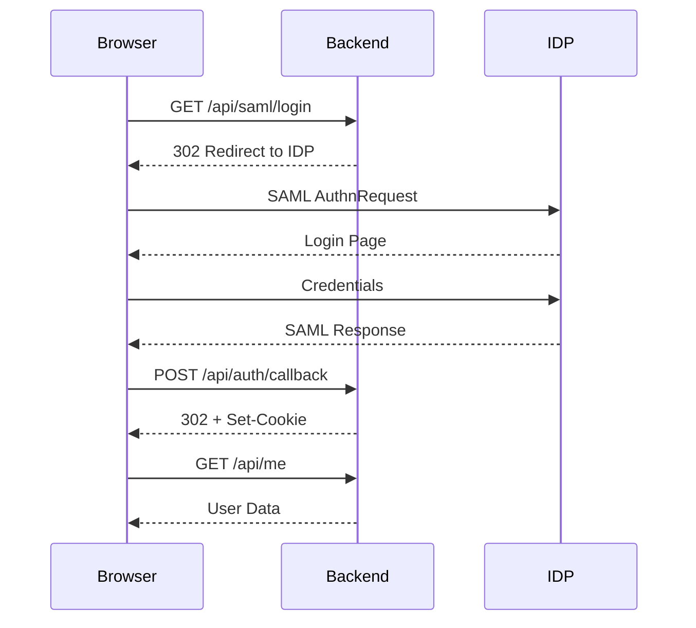

# Authentication API

SAML2 authentication endpoints for the Server Building Dashboard.

## Overview

The application uses SAML2 for enterprise single sign-on (SSO) with support for Microsoft Azure AD, ADFS, and other SAML-compliant identity providers.

## Authentication Flow



---

## Endpoints

### Initiate SAML Login

Start the SAML authentication flow.

```http
GET /api/saml/login
```

#### Request

No parameters required.

#### Response

```http
HTTP/1.1 302 Found
Location: https://login.microsoftonline.com/...?SAMLRequest=...
```

#### Example

```bash
curl -v http://localhost:8000/api/saml/login
```

**Frontend Usage:**
```javascript
window.location.href = `${BACKEND_URL}/api/saml/login`;
```

---

### SAML Callback

Handle the SAML response from the identity provider.

```http
POST /api/auth/callback
```

#### Request

| Field | Type | Description |
|-------|------|-------------|
| `SAMLResponse` | string | Base64-encoded SAML response |

**Content-Type:** `application/x-www-form-urlencoded`

The identity provider automatically POSTs this after successful authentication.

#### Response

```http
HTTP/1.1 302 Found
Location: http://localhost:5173/auth/callback
Set-Cookie: session_token=abc123...; HttpOnly; Secure; SameSite=Lax; Path=/; Max-Age=28800
```

#### Cookie Details

| Attribute | Value | Description |
|-----------|-------|-------------|
| `HttpOnly` | true | Not accessible via JavaScript |
| `Secure` | true (prod) | HTTPS only |
| `SameSite` | Lax | CSRF protection |
| `Path` | / | Available site-wide |
| `Max-Age` | 28800 | 8 hours (configurable) |

#### Errors

| Status | Description |
|--------|-------------|
| 401 | Invalid SAML response or signature |
| 403 | User not authorized (not in permission list) |

---

### Get Current User

Retrieve information about the authenticated user.

```http
GET /api/me
```

#### Request

Requires valid session cookie.

#### Response

```json
{
  "id": "user@example.com",
  "email": "user@example.com",
  "name": "John Doe",
  "role": "operator",
  "groups": [
    "Dashboard-Operators",
    "IT-Team"
  ],
  "is_admin": false,
  "allowed_regions": [
    "cbg",
    "dub"
  ]
}
```

#### Response Fields

| Field | Type | Description |
|-------|------|-------------|
| `id` | string | User identifier (email) |
| `email` | string | User email address |
| `name` | string | Display name |
| `role` | string | Role: `user`, `operator`, or `admin` |
| `groups` | array | SAML group memberships |
| `is_admin` | boolean | Has admin privileges |
| `allowed_regions` | array | Accessible regions |

#### Example

```bash
curl -b cookies.txt http://localhost:8000/api/me
```

```javascript
const response = await fetch('/api/me', {
  credentials: 'include'
});
const user = await response.json();
```

#### Errors

| Status | Description |
|--------|-------------|
| 401 | No session or session expired |

---

### Logout

End the current session.

```http
POST /api/logout
```

#### Request

Requires valid session cookie.

#### Response

```json
{
  "status": "success",
  "message": "Logged out successfully"
}
```

```http
Set-Cookie: session_token=; Max-Age=0; Path=/
```

#### Example

```bash
curl -X POST -b cookies.txt http://localhost:8000/api/logout
```

```javascript
await fetch('/api/logout', {
  method: 'POST',
  credentials: 'include'
});
// Clear local auth state and redirect to login
```

---

## Session Management

### Session Storage

Sessions are stored in-memory with the following structure:

```python
{
  "token_abc123": {
    "user_data": {
      "email": "user@example.com",
      "name": "John Doe",
      "role": "operator",
      "groups": ["Dashboard-Operators"]
    },
    "created_at": "2025-01-01T12:00:00",
    "expires_at": "2025-01-01T20:00:00"
  }
}
```

### Session Lifetime

Default: 8 hours (28800 seconds)

Configure via `SESSION_LIFETIME_SECONDS` environment variable.

### Session Validation

Every authenticated request:
1. Extracts `session_token` cookie
2. Looks up session in store
3. Checks expiration
4. Loads user permissions
5. Returns 401 if invalid

---

## SAML Attribute Mapping

The backend extracts user attributes from the SAML response:

| SAML Attribute | User Field |
|----------------|------------|
| NameID | email (primary) |
| `http://schemas.xmlsoap.org/ws/2005/05/identity/claims/emailaddress` | email (fallback) |
| `http://schemas.xmlsoap.org/ws/2005/05/identity/claims/givenname` | name (first part) |
| `http://schemas.xmlsoap.org/ws/2005/05/identity/claims/surname` | name (last part) |
| `http://schemas.microsoft.com/ws/2008/06/identity/claims/groups` | groups |

### Role Determination

Roles are determined by group membership:

| Role | Groups |
|------|--------|
| admin | Dashboard-Admins, IT-Admins |
| operator | Dashboard-Operators, IT-Operators |
| user | (default) |

---

## Permission System

### Admin Access

Users listed in `config.json` → `permissions.admins`:
- Access all regions
- `is_admin: true`

### Builder Access

Users listed in `config.json` → `permissions.builders.{region}`:
- Access specific regions only
- `is_admin: false`

### Example Configuration

```json
{
  "permissions": {
    "admins": [
      "admin@example.com",
      "super.user@example.com"
    ],
    "builders": {
      "cbg": ["cambridge-team@example.com"],
      "dub": ["dublin-team@example.com"],
      "dal": ["dallas-ops@example.com"]
    }
  }
}
```

---

## Frontend Integration

### AuthContext Usage

```typescript
import { useAuth } from '@/contexts/AuthContext';

function Component() {
  const { user, isAuthenticated, login, logout, checkAuth } = useAuth();

  if (!isAuthenticated) {
    return <button onClick={login}>Login</button>;
  }

  return (
    <div>
      <p>Welcome, {user.name}</p>
      <p>Regions: {user.allowed_regions.join(', ')}</p>
      <button onClick={logout}>Logout</button>
    </div>
  );
}
```

### Protected Route

```typescript
function ProtectedRoute({ children }) {
  const { isAuthenticated, isLoading } = useAuth();

  if (isLoading) return <Spinner />;
  if (!isAuthenticated) return <Navigate to="/login" />;

  return children;
}
```

---

## Troubleshooting

### Common Issues

**401 Unauthorized on /api/me**
- Session expired (re-login required)
- Cookie not sent (check `credentials: 'include'`)
- Cookie domain mismatch

**403 Forbidden after login**
- User not in permissions list
- Check `config.json` permissions

**SAML Error**
- Invalid IDP metadata
- ACS URL mismatch
- Clock skew between servers

### Debug Mode

Set `LOG_LEVEL=DEBUG` to see detailed SAML processing logs.

---

## Next Steps

- [Build Endpoints](build-endpoints.md) - Build status API
- [Permissions](../security/permissions.md) - Permission system
- [SAML Configuration](../security/authentication.md) - IDP setup
