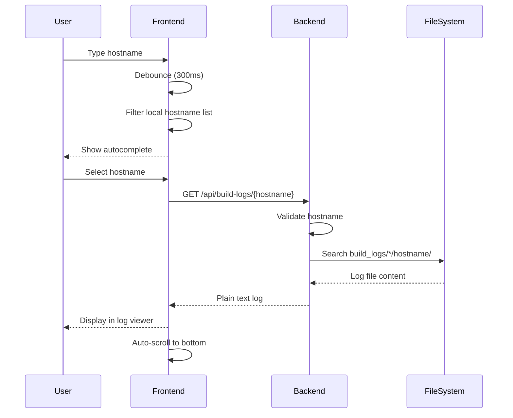

# Logs Endpoints

API endpoint for retrieving server build logs.

## Overview

| Endpoint | Description |
|----------|-------------|
| `GET /api/build-logs/{hostname}` | Get build log for a server |

---

## Get Build Log

Retrieve the build log file for a specific server.

```http
GET /api/build-logs/{hostname}
```

### Path Parameters

| Parameter | Type | Required | Description |
|-----------|------|----------|-------------|
| `hostname` | string | Yes | Server hostname |

### Response

**Content-Type:** `text/plain; charset=utf-8`

```
[2025-01-01 10:00:00] Starting installation for cbg-srv-001
[2025-01-01 10:00:01] Initializing hardware...
[2025-01-01 10:00:05] Hardware initialized successfully
[2025-01-01 10:00:10] Downloading base image...
[2025-01-01 10:05:30] Base image downloaded (5.2GB)
[2025-01-01 10:05:35] Partitioning disk...
[2025-01-01 10:06:00] Installing operating system...
[2025-01-01 10:30:00] OS installation complete
[2025-01-01 10:30:05] Configuring network...
[2025-01-01 10:30:30] Network configured (IP: 192.168.1.100)
[2025-01-01 10:30:35] Installing packages...
[2025-01-01 10:45:00] Package installation complete
[2025-01-01 10:45:05] Running post-install scripts...
[2025-01-01 10:50:00] Installation complete
```

### Response Headers

| Header | Description |
|--------|-------------|
| `Content-Type` | `text/plain; charset=utf-8` |
| `X-Build-Server` | Build server where log was found |

### Example

```bash
curl -b cookies.txt http://localhost:8000/api/build-logs/cbg-srv-001
```

**With build server info:**
```bash
curl -v -b cookies.txt http://localhost:8000/api/build-logs/cbg-srv-001 2>&1 | grep X-Build-Server
# < X-Build-Server: cbg-build-01
```

```javascript
const response = await fetch('/api/build-logs/cbg-srv-001', {
  credentials: 'include'
});

const buildServer = response.headers.get('X-Build-Server');
const logText = await response.text();

console.log(`Log from ${buildServer}:`);
console.log(logText);
```

### Errors

| Status | Code | Description |
|--------|------|-------------|
| 400 | BAD_REQUEST | Invalid hostname format or too long |
| 401 | UNAUTHORIZED | Invalid session |
| 404 | NOT_FOUND | Log file not found |
| 500 | INTERNAL_ERROR | File too large, permission error, encoding issue |

**Error Response:**
```json
{
  "detail": "Log file not found for hostname: cbg-srv-001"
}
```

---

## Hostname Validation

The hostname is validated against a configurable regex pattern:

**Default Pattern:** `^[a-zA-Z0-9._-]+$`

**Validation Rules:**
- Allowed characters: letters, numbers, dots, underscores, hyphens
- Maximum length: 253 characters (DNS limit)
- No path traversal characters (`/`, `\`, `..`)

**Error Response (Invalid Hostname):**
```json
{
  "detail": "Invalid hostname format"
}
```

---

## Log File Discovery

The backend searches for logs in the following structure:

```
BUILD_LOGS_DIR/
├── cbg-build-01/
│   ├── cbg-srv-001/
│   │   └── cbg-srv-001-Installer.log
│   └── cbg-srv-002/
│       └── cbg-srv-002-Installer.log
├── cbg-build-02/
│   └── cbg-srv-003/
│       └── cbg-srv-003-Installer.log
└── dub-build-01/
    └── dub-srv-001/
        └── dub-srv-001-Installer.log
```

**Search Algorithm:**
1. Iterate through build server directories (sorted alphabetically)
2. Check for `{hostname}/{hostname}-Installer.log`
3. Return first match found
4. 404 if no log found in any build server

---

## Security Measures

### Path Traversal Prevention

```python
# Validate resolved path is within BUILD_LOGS_DIR
resolved_path = log_path.resolve()
if not resolved_path.is_relative_to(build_logs_dir):
    raise HTTPException(400, "Invalid hostname")
```

### File Size Limit

Maximum file size: **10 MB**

```python
if file_stat.st_size > 10 * 1024 * 1024:
    raise HTTPException(500, "Log file too large")
```

### Encoding Validation

Files must be valid UTF-8:

```python
try:
    content = log_path.read_text(encoding='utf-8')
except UnicodeDecodeError:
    raise HTTPException(500, "Invalid log file encoding")
```

---

## Frontend Hook Usage

### useBuildLog

```typescript
import { useBuildLog } from '@/hooks/useBuildLog';

function LogViewer({ hostname }) {
  const { log, isLoading, error, fetchLog } = useBuildLog();

  useEffect(() => {
    if (hostname) {
      fetchLog(hostname);
    }
  }, [hostname, fetchLog]);

  if (isLoading) return <Loading />;
  if (error) return <Error message={error} />;

  return (
    <pre className="font-mono text-sm whitespace-pre-wrap bg-gray-900 p-4 overflow-auto">
      {log}
    </pre>
  );
}
```

### useHostnames

For hostname autocomplete:

```typescript
import { useHostnames } from '@/hooks/useHostnames';

function HostnameSearch({ onSelect }) {
  const { hostnames, isLoading } = useHostnames();
  const [query, setQuery] = useState('');

  // Filter and rank results
  const results = useMemo(() => {
    if (!query) return [];

    return hostnames
      .filter(h => h.toLowerCase().includes(query.toLowerCase()))
      .sort((a, b) => {
        // Exact match first
        if (a.toLowerCase() === query.toLowerCase()) return -1;
        if (b.toLowerCase() === query.toLowerCase()) return 1;
        // Starts with query second
        const aStarts = a.toLowerCase().startsWith(query.toLowerCase());
        const bStarts = b.toLowerCase().startsWith(query.toLowerCase());
        if (aStarts && !bStarts) return -1;
        if (bStarts && !aStarts) return 1;
        // Alphabetical
        return a.localeCompare(b);
      })
      .slice(0, 5);
  }, [hostnames, query]);

  return (
    <div>
      <input
        value={query}
        onChange={e => setQuery(e.target.value)}
        placeholder="Search hostname..."
      />
      <ul>
        {results.map(hostname => (
          <li key={hostname} onClick={() => onSelect(hostname)}>
            {hostname}
          </li>
        ))}
      </ul>
    </div>
  );
}
```

---

## Log Viewer UI

The Build Logs page provides:

1. **Hostname search** with autocomplete (top 5 results)
2. **Keyboard navigation** (arrow keys, Enter, Escape)
3. **Auto-scroll** to bottom when log loads
4. **Monospace display** for proper formatting
5. **Error handling** for 404 responses



---

## Configuration

### Environment Variables

| Variable | Default | Description |
|----------|---------|-------------|
| `BUILD_LOGS_DIR` | `./build_logs` | Log files directory |
| `HOSTNAME_PATTERN` | `^[a-zA-Z0-9._-]+$` | Hostname validation regex |

### Example Configuration

```env
BUILD_LOGS_DIR=/var/log/server-builds
HOSTNAME_PATTERN=^[a-z]{3}-srv-[0-9]{3}$
```

---

## Next Steps

- [Error Reference](error-reference.md) - All error codes
- [Features: Build Logs](../features/build-logs.md) - Feature guide
- [Configuration](../getting-started/configuration.md) - Setup options
