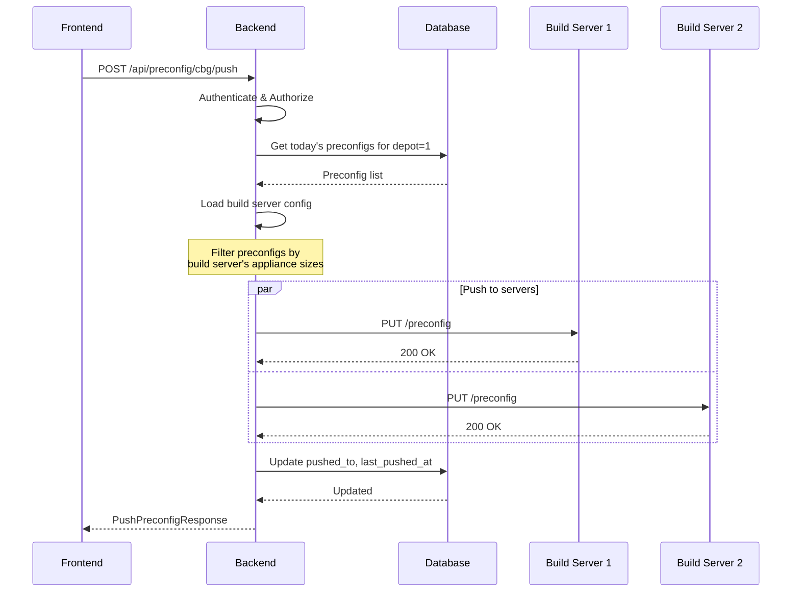

# Preconfig Endpoints

API endpoints for managing server preconfigurations.

## Overview

| Endpoint | Description |
|----------|-------------|
| `GET /api/preconfig/{region}` | Get preconfigs for a region |
| `GET /api/preconfig/pushed` | Get previously pushed preconfigs |
| `POST /api/preconfig/{region}/push` | Push preconfigs to build servers |

---

## Get Region Preconfigs

Retrieve preconfigurations for a specific region.

```http
GET /api/preconfig/{region}
```

### Path Parameters

| Parameter | Type | Required | Description |
|-----------|------|----------|-------------|
| `region` | string | Yes | Region code: `cbg`, `dub`, or `dal` |

### Response

```json
[
  {
    "dbid": "dbid-001-001",
    "depot": 1,
    "appliance_size": "small",
    "config": {
      "os": "Ubuntu 22.04 LTS",
      "cpu": "2x Intel Xeon Gold 6248R",
      "ram": "128GB DDR4",
      "storage": "4x 1TB NVMe SSD",
      "raid": "RAID 10",
      "network": "2x 25Gbps"
    },
    "created_at": "2025-01-01T10:00:00",
    "last_pushed_at": null,
    "pushed_to": []
  },
  {
    "dbid": "dbid-001-002",
    "depot": 1,
    "appliance_size": "medium",
    "config": {
      "os": "Rocky Linux 9",
      "cpu": "4x Intel Xeon Platinum 8380",
      "ram": "256GB DDR4",
      "storage": "8x 2TB NVMe SSD",
      "raid": "RAID 6",
      "network": "4x 25Gbps"
    },
    "created_at": "2025-01-01T11:00:00",
    "last_pushed_at": "2025-01-01T12:00:00",
    "pushed_to": ["cbg-build-01"]
  }
]
```

### Response Fields

| Field | Type | Description |
|-------|------|-------------|
| `dbid` | string | Preconfig database ID |
| `depot` | integer | Depot identifier |
| `appliance_size` | string | Size: `small`, `medium`, or `large` |
| `config` | object | Configuration details |
| `created_at` | datetime | Creation timestamp |
| `last_pushed_at` | datetime | Last push time (null if never) |
| `pushed_to` | array | Build servers that received this preconfig |

### Example

```bash
curl -b cookies.txt http://localhost:8000/api/preconfig/cbg
```

```javascript
const response = await fetch('/api/preconfig/cbg', {
  credentials: 'include'
});
const preconfigs = await response.json();

// Group by appliance size
const bySize = preconfigs.reduce((acc, p) => {
  acc[p.appliance_size] = acc[p.appliance_size] || [];
  acc[p.appliance_size].push(p);
  return acc;
}, {});
```

### Errors

| Status | Description |
|--------|-------------|
| 400 | Invalid region code |
| 401 | Unauthorized |
| 403 | User doesn't have access to this region |

---

## Get Pushed Preconfigs

Retrieve preconfigs that have been pushed to build servers.

```http
GET /api/preconfig/pushed
```

### Response

```json
[
  {
    "dbid": "dbid-001-002",
    "depot": 1,
    "appliance_size": "medium",
    "config": {
      "os": "Rocky Linux 9",
      "cpu": "4x Intel Xeon Platinum 8380",
      "ram": "256GB DDR4",
      "storage": "8x 2TB NVMe SSD"
    },
    "created_at": "2025-01-01T11:00:00",
    "last_pushed_at": "2025-01-01T12:00:00",
    "pushed_to": ["cbg-build-01", "cbg-build-02"]
  }
]
```

### Permission Filtering

- **Admin users:** See all pushed preconfigs
- **Builder users:** See only preconfigs for their allowed regions

### Example

```bash
curl -b cookies.txt http://localhost:8000/api/preconfig/pushed
```

### Errors

| Status | Description |
|--------|-------------|
| 401 | Unauthorized |

---

## Push Preconfigs

Push preconfigs to all build servers in a region.

```http
POST /api/preconfig/{region}/push
```

### Path Parameters

| Parameter | Type | Required | Description |
|-----------|------|----------|-------------|
| `region` | string | Yes | Region code: `cbg`, `dub`, or `dal` |

### Request

No request body required. The system:
1. Queries preconfigs created today for the region
2. Gets build server configuration from `config.json`
3. Pushes filtered preconfigs to each build server

### Response

```json
{
  "status": "success",
  "message": "Successfully pushed preconfigs to 2 build server(s)",
  "results": [
    {
      "build_server": "cbg-build-01",
      "status": "success",
      "error": null,
      "preconfig_count": 3
    },
    {
      "build_server": "cbg-build-02",
      "status": "success",
      "error": null,
      "preconfig_count": 2
    }
  ],
  "pushed_preconfigs": [
    {
      "dbid": "dbid-001-001",
      "depot": 1,
      "appliance_size": "small",
      "config": {...},
      "created_at": "2025-01-01T10:00:00",
      "last_pushed_at": "2025-01-01T14:00:00",
      "pushed_to": ["cbg-build-01"]
    }
  ]
}
```

### Response Fields

**PushPreconfigResponse:**

| Field | Type | Description |
|-------|------|-------------|
| `status` | string | Overall status: `success`, `partial`, or `failed` |
| `message` | string | Summary message |
| `results` | array | Per-build-server results |
| `pushed_preconfigs` | array | Preconfigs that were pushed |

**BuildServerPushResult:**

| Field | Type | Description |
|-------|------|-------------|
| `build_server` | string | Build server hostname |
| `status` | string | `success`, `failed`, or `skipped` |
| `error` | string | Error message (null if success) |
| `preconfig_count` | integer | Number of preconfigs pushed |

### Status Values

| Status | Meaning |
|--------|---------|
| `success` | All build servers received preconfigs |
| `partial` | Some build servers succeeded, some failed |
| `failed` | All build servers failed |

### Example

```bash
curl -X POST \
  -b cookies.txt \
  http://localhost:8000/api/preconfig/cbg/push
```

```javascript
const response = await fetch('/api/preconfig/cbg/push', {
  method: 'POST',
  credentials: 'include'
});

const result = await response.json();

if (result.status === 'success') {
  console.log(`Pushed to ${result.results.length} build servers`);
} else if (result.status === 'partial') {
  const failed = result.results.filter(r => r.status === 'failed');
  console.error(`${failed.length} build servers failed`);
}
```

### Errors

| Status | Description |
|--------|-------------|
| 400 | Invalid region code |
| 401 | Unauthorized |
| 403 | User doesn't have access to this region |
| 404 | No build servers configured for region |

---

## Push Workflow



---

## Build Server Configuration

Preconfigs are filtered by build server capability:

```json
// config.json
{
  "regions": {
    "cbg": {
      "build_servers": {
        "cbg-build-01": {
          "preconfigs": ["small", "medium"]
        },
        "cbg-build-02": {
          "preconfigs": ["large"]
        }
      }
    }
  }
}
```

**Push Logic:**
- `cbg-build-01` receives preconfigs with `appliance_size` = "small" or "medium"
- `cbg-build-02` receives preconfigs with `appliance_size` = "large"

---

## Payload to Build Server

The backend sends a PUT request to each build server:

```http
PUT https://{build_server}{BUILD_SERVER_DOMAIN}/preconfig
Content-Type: application/json

[
  {
    "dbid": "dbid-001-001",
    "depot": 1,
    "appliance_size": "small",
    "config": {
      "os": "Ubuntu 22.04 LTS",
      "cpu": "2x Intel Xeon Gold 6248R",
      "ram": "128GB DDR4",
      "storage": "4x 1TB NVMe SSD"
    }
  }
]
```

---

## Frontend Hook Usage

### usePreconfigs

```typescript
import { usePreconfigs } from '@/hooks/usePreconfigs';

function PreconfigList({ region }) {
  const { preconfigs, isLoading, error, refetch } = usePreconfigs(region);

  if (isLoading) return <Loading />;
  if (error) return <Error message={error} />;

  return (
    <table>
      <thead>
        <tr>
          <th>DBID</th>
          <th>Size</th>
          <th>Created</th>
          <th>Pushed</th>
        </tr>
      </thead>
      <tbody>
        {preconfigs.map(p => (
          <tr key={p.dbid}>
            <td>{p.dbid}</td>
            <td>{p.appliance_size}</td>
            <td>{p.created_at}</td>
            <td>{p.last_pushed_at || 'Never'}</td>
          </tr>
        ))}
      </tbody>
    </table>
  );
}
```

### usePushPreconfig

```typescript
import { usePushPreconfig } from '@/hooks/usePushPreconfig';

function PushButton({ region }) {
  const {
    status,
    results,
    pushedPreconfigs,
    error,
    overallStatus,
    pushPreconfig,
    reset
  } = usePushPreconfig();

  const handlePush = () => {
    pushPreconfig(region);
  };

  return (
    <div>
      <button
        onClick={handlePush}
        disabled={status === 'pushing'}
      >
        {status === 'pushing' ? 'Pushing...' : 'Push to Build Servers'}
      </button>

      {status === 'complete' && (
        <div>
          <p>Status: {overallStatus}</p>
          {results.map(r => (
            <div key={r.build_server}>
              {r.build_server}: {r.status}
              {r.error && <span> - {r.error}</span>}
            </div>
          ))}
        </div>
      )}
    </div>
  );
}
```

---

## Next Steps

- [Logs Endpoints](logs-endpoints.md) - Build log retrieval
- [Features: Preconfig Management](../features/preconfig-management.md) - Feature guide
- [Configuration](../getting-started/configuration.md) - Build server setup
