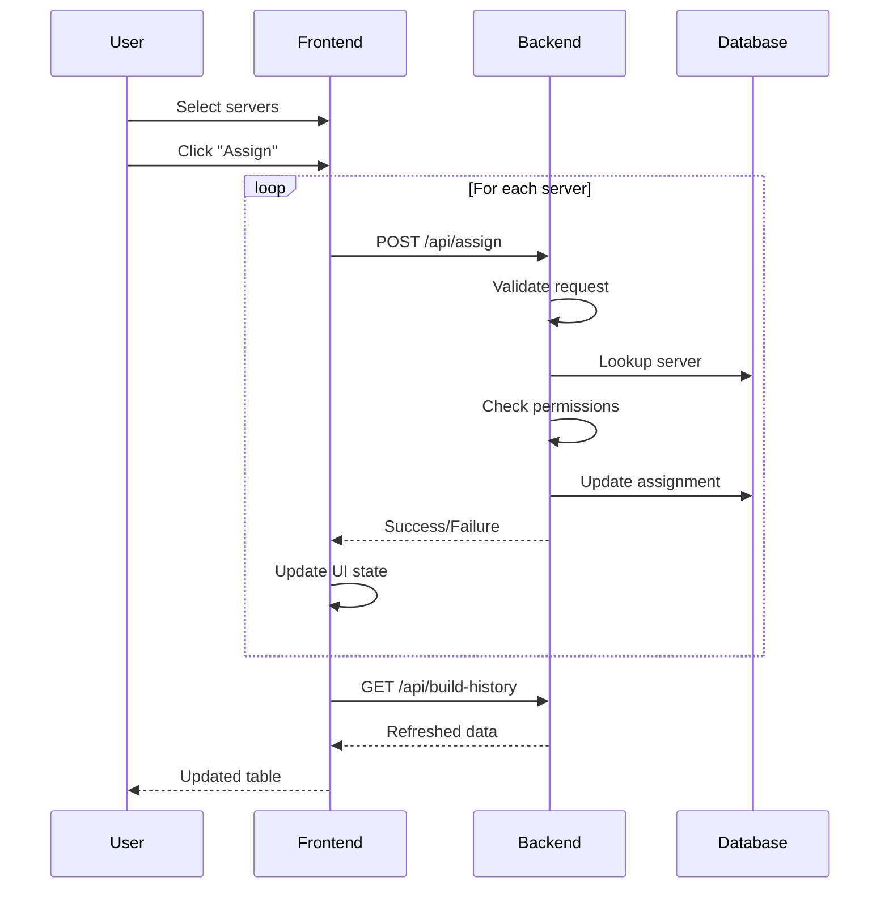

# Server Endpoints

API endpoints for server details and assignment.

## Overview

| Endpoint | Description |
|----------|-------------|
| `GET /api/server-details` | Get detailed server information |
| `POST /api/assign` | Assign a server to a customer |

---

## Get Server Details

Retrieve detailed information about a specific server.

```http
GET /api/server-details?hostname={hostname}
```

### Query Parameters

| Parameter | Type | Required | Description |
|-----------|------|----------|-------------|
| `hostname` | string | Yes | Server hostname |

### Response

```json
{
  "rackID": "1-E",
  "hostname": "cbg-srv-001",
  "dbid": "100001",
  "serial_number": "SN-CBG-001",
  "percent_built": 65,
  "assigned_status": "not assigned",
  "machine_type": "Server",
  "status": "installing",
  "ip_address": "192.168.1.100",
  "mac_address": "00:1A:2B:3C:4D:5E",
  "cpu_model": "Intel Xeon Gold 6248R",
  "ram_gb": 128,
  "storage_gb": 4000,
  "install_start_time": "2025-01-01T10:00:00",
  "estimated_completion": "2025-01-01T12:00:00",
  "last_heartbeat": "2025-01-01T11:55:00"
}
```

### Response Fields

| Field | Type | Description |
|-------|------|-------------|
| `rackID` | string | Rack identifier |
| `hostname` | string | Server hostname |
| `dbid` | string | Database identifier |
| `serial_number` | string | Hardware serial number |
| `percent_built` | integer | Build progress (0-100) |
| `assigned_status` | string | "assigned" or "not assigned" |
| `machine_type` | string | Server type |
| `status` | string | Build status |
| `ip_address` | string | IP address (optional) |
| `mac_address` | string | MAC address (optional) |
| `cpu_model` | string | CPU model (optional) |
| `ram_gb` | integer | RAM in GB (optional) |
| `storage_gb` | integer | Storage in GB (optional) |
| `install_start_time` | datetime | Build start time (optional) |
| `estimated_completion` | datetime | Estimated completion (optional) |
| `last_heartbeat` | datetime | Last heartbeat time (optional) |

### Example

```bash
curl -b cookies.txt "http://localhost:8000/api/server-details?hostname=cbg-srv-001"
```

```javascript
const response = await fetch(
  `/api/server-details?hostname=${encodeURIComponent(hostname)}`,
  { credentials: 'include' }
);
const serverDetails = await response.json();
```

### Errors

| Status | Description |
|--------|-------------|
| 400 | Missing hostname parameter |
| 401 | Unauthorized |
| 404 | Server not found |

---

## Assign Server

Assign a completed server to a customer.

```http
POST /api/assign
```

### Request Body

```json
{
  "serial_number": "SN-CBG-001",
  "hostname": "cbg-srv-001",
  "dbid": "100001"
}
```

### Request Fields

| Field | Type | Required | Description |
|-------|------|----------|-------------|
| `serial_number` | string | Yes | Hardware serial number |
| `hostname` | string | Yes | Server hostname |
| `dbid` | string | Yes | Database identifier |

### Response

**Success:**
```json
{
  "status": "success",
  "message": "Server cbg-srv-001 assigned successfully"
}
```

**Failure:**
```json
{
  "status": "failed",
  "message": "Failed to assign server: Server not found"
}
```

### Response Fields

| Field | Type | Description |
|-------|------|-------------|
| `status` | string | "success" or "failed" |
| `message` | string | Result description |

### Example

```bash
curl -X POST \
  -b cookies.txt \
  -H "Content-Type: application/json" \
  -d '{"serial_number":"SN-CBG-001","hostname":"cbg-srv-001","dbid":"100001"}' \
  http://localhost:8000/api/assign
```

```javascript
const response = await fetch('/api/assign', {
  method: 'POST',
  credentials: 'include',
  headers: {
    'Content-Type': 'application/json'
  },
  body: JSON.stringify({
    serial_number: 'SN-CBG-001',
    hostname: 'cbg-srv-001',
    dbid: '100001'
  })
});

const result = await response.json();
if (result.status === 'success') {
  console.log('Server assigned!');
}
```

### Assignment Process

1. Validate request body
2. Look up server by DBID in database
3. Check user has permission for server's region
4. Update server record:
   - `assigned_status` → "assigned"
   - `assigned_by` → user's email
   - `assigned_at` → current timestamp
5. Return success/failure status

### Errors

| Status | Description |
|--------|-------------|
| 400 | Missing required fields |
| 401 | Unauthorized |
| 403 | User doesn't have access to this region |
| 404 | Server not found |

---

## Frontend Hook Usage

### useServerDetails

```typescript
import { useServerDetails } from '@/hooks/useServerDetails';

function ServerModal({ hostname, onClose }) {
  const { serverDetails, isLoading, error, fetchServerDetails, clearServerDetails } = useServerDetails();

  useEffect(() => {
    if (hostname) {
      fetchServerDetails(hostname);
    }
    return () => clearServerDetails();
  }, [hostname]);

  if (isLoading) return <Loading />;
  if (error) return <Error message={error} />;
  if (!serverDetails) return null;

  return (
    <Modal onClose={onClose}>
      <h2>{serverDetails.hostname}</h2>
      <div>Status: {serverDetails.status}</div>
      <div>Progress: {serverDetails.percent_built}%</div>
      <div>CPU: {serverDetails.cpu_model}</div>
      <div>RAM: {serverDetails.ram_gb}GB</div>
      <div>Storage: {serverDetails.storage_gb}GB</div>
    </Modal>
  );
}
```

### useAssignServers

```typescript
import { useAssignServers } from '@/hooks/useAssignServers';

function AssignmentPage() {
  const { assignServers, assignmentStates, error } = useAssignServers();
  const [selectedServers, setSelectedServers] = useState([]);

  const handleAssign = async () => {
    await assignServers(selectedServers);
    // assignmentStates[dbid] = 'success' | 'failed' | 'loading'
  };

  return (
    <div>
      <ServerList
        servers={servers}
        onSelect={setSelectedServers}
        states={assignmentStates}
      />
      <button onClick={handleAssign}>
        Assign {selectedServers.length} Servers
      </button>
    </div>
  );
}
```

---

## Assignment Workflow



---

## Bulk Assignment

The frontend handles bulk assignment by making sequential requests:

```typescript
const assignServers = async (servers: Server[]) => {
  for (const server of servers) {
    setAssignmentStates(prev => ({
      ...prev,
      [server.dbid]: 'loading'
    }));

    try {
      const result = await assignServer(server);
      setAssignmentStates(prev => ({
        ...prev,
        [server.dbid]: result.status
      }));
    } catch {
      setAssignmentStates(prev => ({
        ...prev,
        [server.dbid]: 'failed'
      }));
    }
  }
};
```

---

## Next Steps

- [Preconfig Endpoints](preconfig-endpoints.md) - Preconfig management
- [Features: Server Assignment](../features/server-assignment.md) - Feature guide
- [Permissions](../security/permissions.md) - Access control
