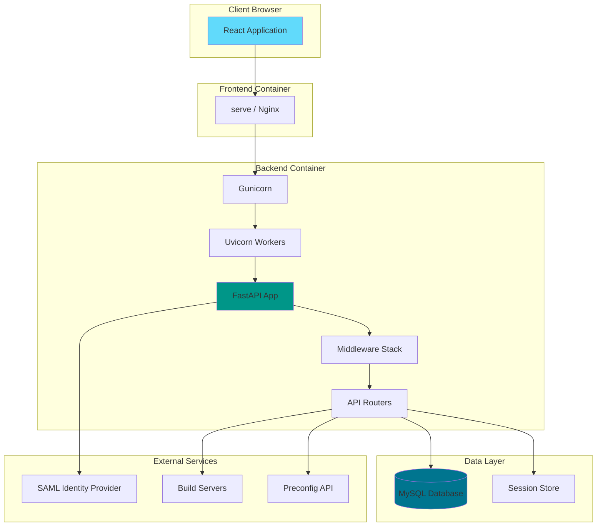
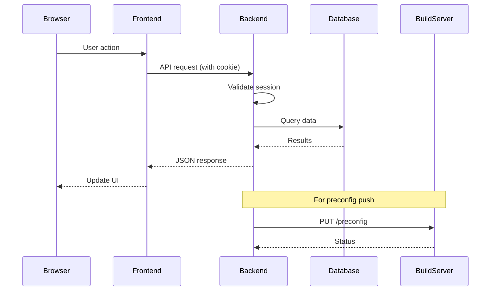

# Architecture Overview

The Server Building Dashboard is a fullstack monorepo application with a React frontend and FastAPI backend.

## Quick Navigation

| Document | Description |
|----------|-------------|
| [Frontend Architecture](frontend.md) | React components, hooks, routing, state |
| [Backend Architecture](backend.md) | FastAPI routers, middleware, models |
| [Data Flow](data-flow.md) | Request flows, authentication, API patterns |

## System Architecture



## Technology Stack

### Frontend
| Technology | Version | Purpose |
|------------|---------|---------|
| React | 18.3 | UI framework |
| TypeScript | 5.5 | Type safety |
| Vite | 5.4 | Build tool |
| Tailwind CSS | 3.4 | Styling |
| React Router | 7.9 | Routing |
| Lucide React | 0.344 | Icons |

### Backend
| Technology | Version | Purpose |
|------------|---------|---------|
| Python | 3.11 | Runtime |
| FastAPI | Latest | Web framework |
| SQLAlchemy | 2.0+ | ORM (async) |
| Pydantic | 2.0+ | Validation |
| python3-saml | Latest | SAML auth |
| Gunicorn | Latest | WSGI server |
| Uvicorn | Latest | ASGI server |

### Infrastructure
| Technology | Purpose |
|------------|---------|
| Docker | Containerization |
| Docker Compose | Orchestration |
| MySQL 8.0 | Database |
| Nginx | Reverse proxy (production) |

## Directory Structure

```
server-building-dashboard/
├── src/                        # Frontend source
│   ├── components/             # Reusable UI components
│   ├── pages/                  # Page components
│   ├── hooks/                  # Custom React hooks (API)
│   ├── contexts/               # React contexts (auth)
│   ├── types/                  # TypeScript definitions
│   └── utils/                  # Utilities
├── backend/                    # Backend source
│   ├── app/                    # Application code
│   │   ├── routers/            # API endpoints
│   │   ├── auth.py             # SAML authentication
│   │   ├── config.py           # Configuration
│   │   ├── middleware.py       # Security/rate limiting
│   │   ├── models.py           # Pydantic models
│   │   └── permissions.py      # Access control
│   ├── tests/                  # Test suite
│   └── main.py                 # Application entry
├── docs/                       # Documentation (this)
└── public/                     # Static assets
```

## Key Design Decisions

### Monorepo Structure
- **Frontend at root**: Follows Vite/React conventions
- **Backend in subdirectory**: Independent deployment possible
- **Shared documentation**: Single source of truth

### Authentication
- **SAML2**: Enterprise SSO integration
- **HTTP-only cookies**: XSS protection
- **In-memory sessions**: Simple, but needs Redis for production scale

### API Design
- **RESTful endpoints**: Standard HTTP methods
- **JSON responses**: Pydantic-validated
- **Correlation IDs**: Request tracing

### Development Experience
- **Dev mode**: Mock data without backend
- **Hot reload**: Both frontend and backend
- **Docker**: Consistent environments

## Component Interaction



## Security Layers

1. **Network**: Docker network isolation
2. **Transport**: HTTPS (via Nginx)
3. **Authentication**: SAML2 + session cookies
4. **Authorization**: Region-based permissions
5. **Middleware**: Rate limiting, security headers
6. **Validation**: Pydantic models, path traversal prevention

## Scaling Considerations

### Current Limitations
- In-memory session storage (single instance only)
- In-memory rate limiting (single instance only)
- Single Gunicorn worker (database connection sharing)

### Production Scaling
1. Add Redis for session storage
2. Add Redis for distributed rate limiting
3. Increase Gunicorn workers
4. Add load balancer for multiple instances

## Next Steps

- [Frontend Architecture](frontend.md) - Component and hook details
- [Backend Architecture](backend.md) - Router and middleware details
- [Data Flow](data-flow.md) - Request flow diagrams
