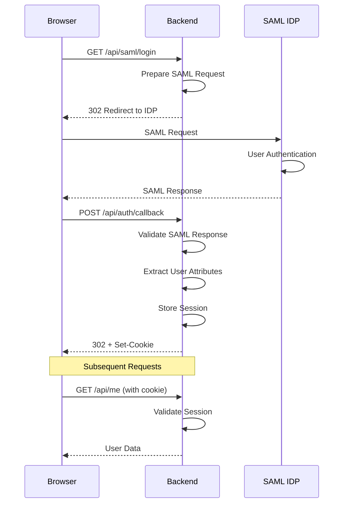

# Backend Architecture

The backend is a FastAPI application with SAML2 authentication, async database support, and comprehensive middleware.

## Directory Structure

```
backend/
├── main.py                  # Application entry, middleware setup
├── app/
│   ├── auth.py              # SAML authentication, sessions
│   ├── config.py            # Environment configuration
│   ├── middleware.py        # Security headers, rate limiting
│   ├── models.py            # Pydantic models
│   ├── permissions.py       # Region-based access control
│   ├── correlation.py       # Request tracing
│   ├── logger.py            # Logging utilities
│   ├── database.py          # SQLAlchemy setup
│   └── routers/
│       ├── build_history.py # Build status & history
│       ├── preconfig.py     # Preconfig management
│       ├── assign.py        # Server assignment
│       ├── server.py        # Server details
│       ├── buildlogs.py     # Build log retrieval
│       └── config.py        # Configuration endpoint
├── tests/                   # Pytest test suite
│   ├── conftest.py          # Test fixtures
│   └── test_*.py            # Test modules
├── config/
│   └── config.json          # Region/permission config
└── saml_metadata/
    └── idp_metadata.xml     # SAML IDP metadata
```

## Application Initialization

```mermaid
graph TD
    A[main.py] --> B[FastAPI App]
    B --> C[Lifespan Manager]
    C --> D[Database Init]
    C --> E[Logging Setup]

    B --> F[Middleware Stack]
    F --> G[Request Logging]
    F --> H[Security Headers]
    F --> I[Rate Limiting]
    F --> J[CORS]

    B --> K[Routers]
    K --> L[/api/build-status]
    K --> M[/api/preconfig]
    K --> N[/api/assign]
    K --> O[/api/server-details]
    K --> P[/api/build-logs]
    K --> Q[/api/config]
```

## Middleware Stack

Middleware is applied in order (bottom-to-top execution):

```python
# 1. Request Logging (outermost)
@app.middleware("http")
async def log_requests(request, call_next):
    correlation_id = request.headers.get("X-Request-ID") or generate_correlation_id()
    set_correlation_id(correlation_id)
    # ... timing and logging

# 2. Security Headers
app.add_middleware(SecurityHeadersMiddleware)

# 3. Rate Limiting
app.add_middleware(RateLimitMiddleware)

# 4. CORS (innermost)
app.add_middleware(CORSMiddleware, ...)
```

### Security Headers Middleware

Adds OWASP-recommended headers:

| Header | Value |
|--------|-------|
| `X-Content-Type-Options` | `nosniff` |
| `X-Frame-Options` | `DENY` |
| `X-XSS-Protection` | `1; mode=block` |
| `Strict-Transport-Security` | `max-age=31536000; includeSubDomains` |
| `Referrer-Policy` | `strict-origin-when-cross-origin` |
| `Content-Security-Policy` | See below |

**CSP Policy:**
```
default-src 'self';
script-src 'self';
style-src 'self' 'unsafe-inline';
img-src 'self' data:;
font-src 'self';
connect-src 'self';
frame-ancestors 'none'
```

### Rate Limiting Middleware

```python
class RateLimitMiddleware:
    sustained_limit = 60   # requests per minute
    burst_limit = 100      # max burst

    # Returns headers:
    # X-RateLimit-Limit: 100
    # X-RateLimit-Remaining: 75
    # X-RateLimit-Reset: <timestamp>
```

**Excluded endpoints:** `/api/health`

## Router Structure

### Base Configuration

All routers mounted under `/api` prefix:

```python
app.include_router(build_history.router, prefix="/api", tags=["build-history"])
app.include_router(preconfig.router, prefix="/api", tags=["preconfig"])
app.include_router(assign.router, prefix="/api", tags=["assign"])
app.include_router(server.router, prefix="/api", tags=["server"])
app.include_router(buildlogs.router, prefix="/api", tags=["buildlogs"])
app.include_router(config.router, prefix="/api", tags=["config"])
```

### Authentication Endpoints (main.py)

| Endpoint | Method | Auth | Description |
|----------|--------|------|-------------|
| `/api/saml/login` | GET | No | Initiate SAML flow |
| `/api/auth/callback` | POST | No | SAML response handler |
| `/api/me` | GET | Yes | Current user info |
| `/api/logout` | POST | Yes | Destroy session |
| `/api/health` | GET | No | Health check |
| `/api` | GET | No | API info |

### Build Router (build_history.py)

| Endpoint | Method | Auth | Description |
|----------|--------|------|-------------|
| `/api/build-status` | GET | Yes | Current builds |
| `/api/build-history/{region}` | GET | Yes | Today's builds |
| `/api/build-history/{region}/{date}` | GET | Yes | Historical builds |

### Preconfig Router (preconfig.py)

| Endpoint | Method | Auth | Description |
|----------|--------|------|-------------|
| `/api/preconfig/{region}` | GET | Yes | Region preconfigs |
| `/api/preconfig/pushed` | GET | Yes | Pushed preconfigs |
| `/api/preconfig/{region}/push` | POST | Yes | Push to build servers |

### Server Router (server.py)

| Endpoint | Method | Auth | Description |
|----------|--------|------|-------------|
| `/api/server-details` | GET | Yes | Server details |

### Assign Router (assign.py)

| Endpoint | Method | Auth | Description |
|----------|--------|------|-------------|
| `/api/assign` | POST | Yes | Assign server |

### Build Logs Router (buildlogs.py)

| Endpoint | Method | Auth | Description |
|----------|--------|------|-------------|
| `/api/build-logs/{hostname}` | GET | Yes | Get build log |

### Config Router (config.py)

| Endpoint | Method | Auth | Description |
|----------|--------|------|-------------|
| `/api/config` | GET | No | Region configuration |

## Authentication Flow



### Session Management

```python
class SAMLAuth:
    _sessions: Dict[str, Dict] = {}

    def store_session(self, token: str, user_data: dict):
        self._sessions[token] = {
            "user_data": user_data,
            "created_at": datetime.utcnow(),
            "expires_at": datetime.utcnow() + timedelta(seconds=28800)
        }

    def get_session(self, token: str) -> Optional[dict]:
        session = self._sessions.get(token)
        if session and session["expires_at"] > datetime.utcnow():
            return session["user_data"]
        return None
```

**Production Note:** Replace with Redis for multi-instance deployment.

## Pydantic Models

### User Model

```python
class User(BaseModel):
    id: str              # Email address
    email: EmailStr
    name: Optional[str]
    role: str = "user"   # user, operator, admin
    groups: List[str] = []
    is_admin: bool = False
    allowed_regions: List[str] = []
```

### Server Models

```python
class Server(BaseModel):
    rackID: str
    hostname: str
    dbid: str
    serial_number: str
    percent_built: int = Field(ge=0, le=100)
    assigned_status: str = "not assigned"
    machine_type: str = "Server"
    status: str = "installing"

class ServerDetails(Server):
    ip_address: Optional[str]
    mac_address: Optional[str]
    cpu_model: Optional[str]
    ram_gb: Optional[int]
    storage_gb: Optional[int]
    install_start_time: Optional[datetime]
    estimated_completion: Optional[datetime]
    last_heartbeat: Optional[datetime]
```

### Preconfig Models

```python
class PreconfigData(BaseModel):
    dbid: str
    depot: int
    appliance_size: Optional[str]
    config: Dict[str, Any]
    created_at: datetime
    last_pushed_at: Optional[datetime]
    pushed_to: List[str] = []

class PushPreconfigResponse(BaseModel):
    status: Literal["success", "partial", "failed"]
    message: str
    results: List[BuildServerPushResult]
    pushed_preconfigs: List[PreconfigData]
```

## Permission System

### Access Control Model

```python
# config.json
{
    "permissions": {
        "admins": ["admin@example.com"],
        "builders": {
            "cbg": ["builder1@example.com"],
            "dub": ["builder2@example.com"]
        }
    }
}
```

### Permission Functions

```python
def get_user_permissions(email: str) -> Tuple[bool, List[str]]:
    """Returns (is_admin, allowed_regions)"""

def check_region_access(email: str, region: str) -> bool:
    """Check if user can access specific region"""

def check_depot_access(email: str, depot: int) -> bool:
    """Check access by depot ID (maps to region)"""
```

### Authentication Dependency

```python
@router.get("/api/build-status")
async def get_build_status(user: User = Depends(get_current_user)):
    # user.is_admin -> full access
    # user.allowed_regions -> filtered access
    ...
```

## Database Layer

### SQLAlchemy Async Setup

```python
# database.py
engine = create_async_engine(
    settings.DATABASE_URL,
    pool_size=settings.DB_POOL_SIZE,
    max_overflow=settings.DB_MAX_OVERFLOW,
    pool_recycle=settings.DB_POOL_RECYCLE
)

async_session = sessionmaker(
    engine, class_=AsyncSession, expire_on_commit=False
)

async def get_db() -> AsyncGenerator[AsyncSession, None]:
    async with async_session() as session:
        yield session
```

### Graceful Degradation

All endpoints work without database, falling back to mock data:

```python
async def get_preconfigs(region: str, db: AsyncSession = Depends(get_db)):
    try:
        result = await db.execute(select(Preconfig).where(...))
        return result.scalars().all()
    except Exception:
        return get_mock_preconfigs(region)
```

## Request Tracing

### Correlation IDs

```python
# correlation.py
_correlation_id: ContextVar[Optional[str]] = ContextVar("correlation_id")

def get_correlation_id() -> Optional[str]:
    return _correlation_id.get(None)

def set_correlation_id(value: str):
    _correlation_id.set(value)

# In middleware
correlation_id = request.headers.get("X-Request-ID") or generate_correlation_id()
set_correlation_id(correlation_id)
response.headers["X-Request-ID"] = correlation_id
```

### Logging

```python
logger.info(
    f"Endpoint={request.url.path} "
    f"Method={request.method} "
    f"Status={response.status_code} "
    f"Duration={duration_ms}ms "
    f"ClientIP={client_ip} "
    f"CorrelationID={correlation_id}"
)
```

## Testing

### Test Configuration

```python
# conftest.py
@pytest.fixture
def client():
    return TestClient(app)

@pytest.fixture
def authenticated_user(client):
    # Set up mock session
    return {"email": "test@example.com", ...}
```

### Running Tests

```bash
# With Docker (recommended)
docker run --rm \
  -v "$(pwd)/tests:/app/tests:ro" \
  server-dashboard-backend-test:latest \
  pytest -v --cov

# Local
pytest -v --cov=app --cov=main
```

## Configuration Management

### Environment-Based (config.py)

```python
class Settings(BaseSettings):
    APP_NAME: str = "Server Building Dashboard"
    ENVIRONMENT: str = "dev"
    SECRET_KEY: str
    # ... more settings

    class Config:
        env_file = ".env"

settings = Settings()
```

### File-Based (config/config.json)

```python
def get_config() -> Dict[str, Any]:
    config_path = Path("config/config.json")
    if not config_path.exists():
        config_path = Path("config/config.json.example")
    return json.loads(config_path.read_text())
```

## Next Steps

- [Data Flow](data-flow.md) - Request patterns and sequences
- [API Reference](../api/README.md) - Endpoint documentation
- [Testing Guide](../development/testing.md) - Testing patterns
