# Data Flow

This document describes the request flows and data patterns in the Server Building Dashboard.

## Authentication Flow

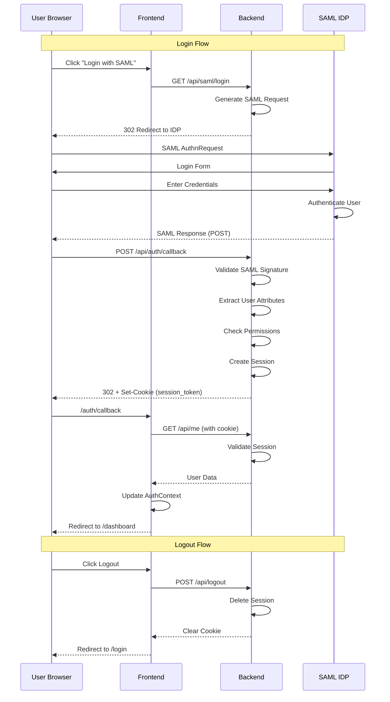

## API Request Flow

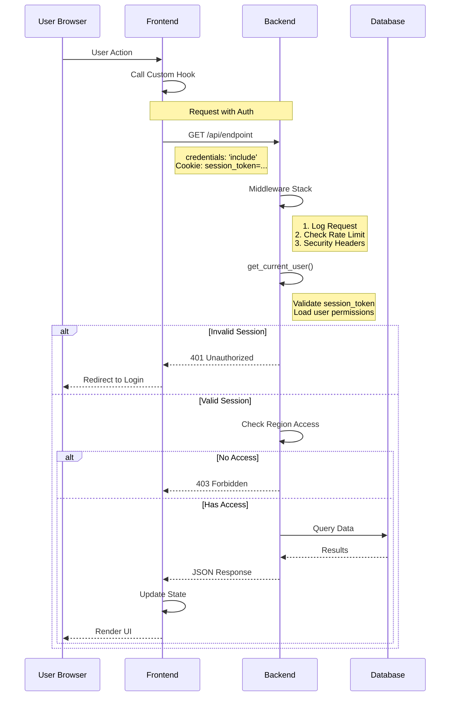

## Build Status Flow

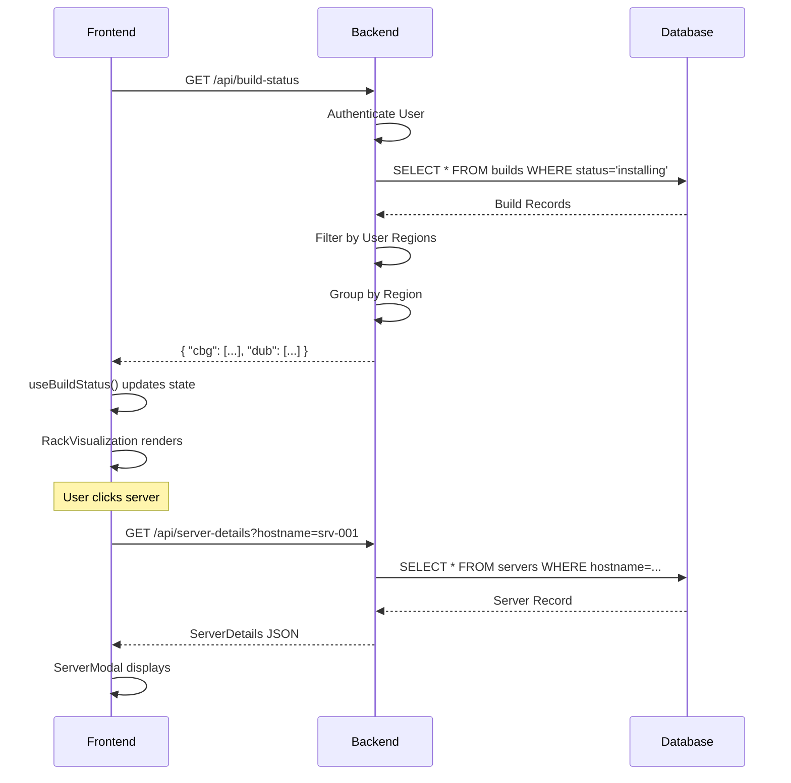

## Preconfig Push Flow

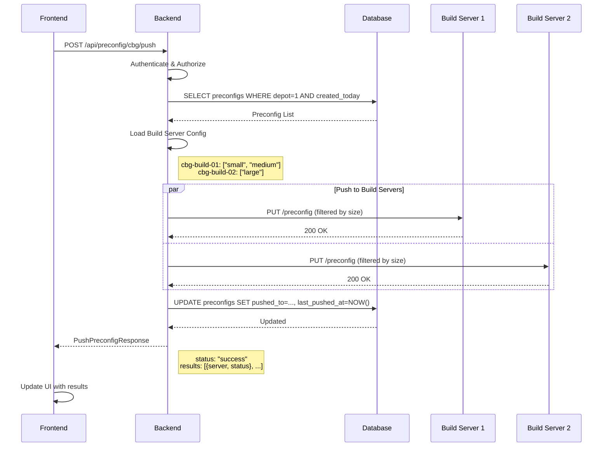

## Server Assignment Flow

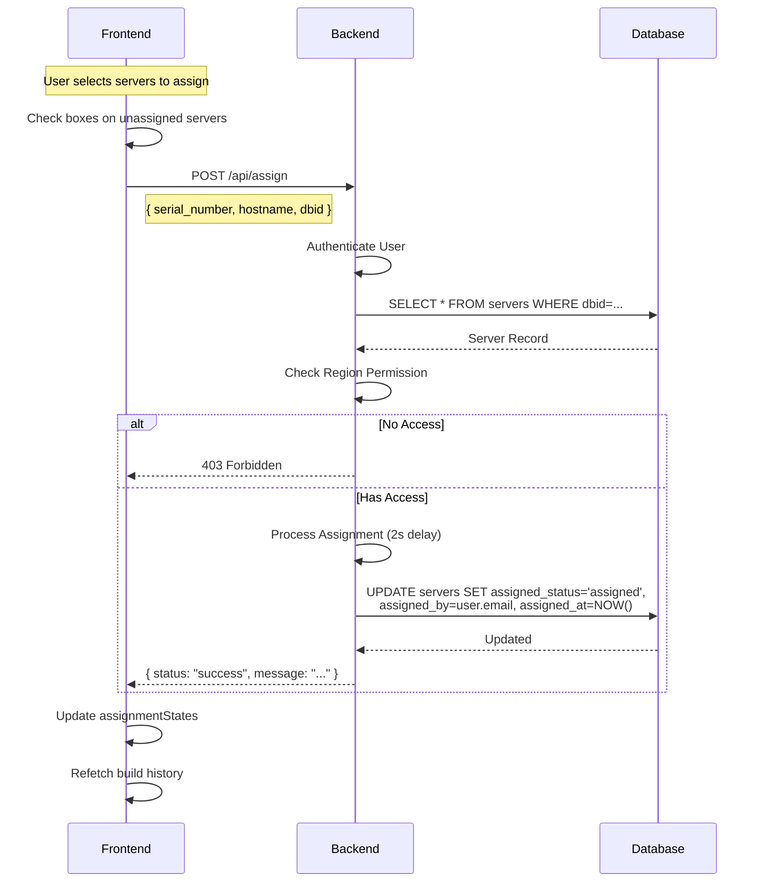

## Build Log Retrieval Flow

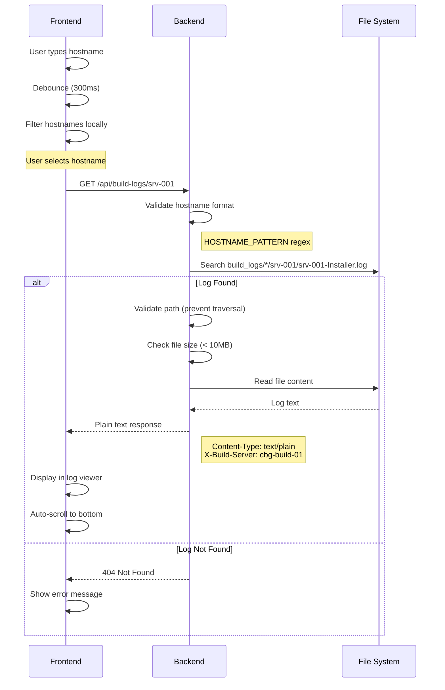

## Dev Mode Fallback Flow

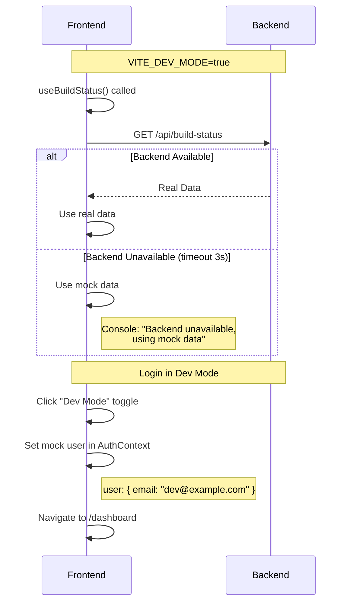

## Region Filtering Flow

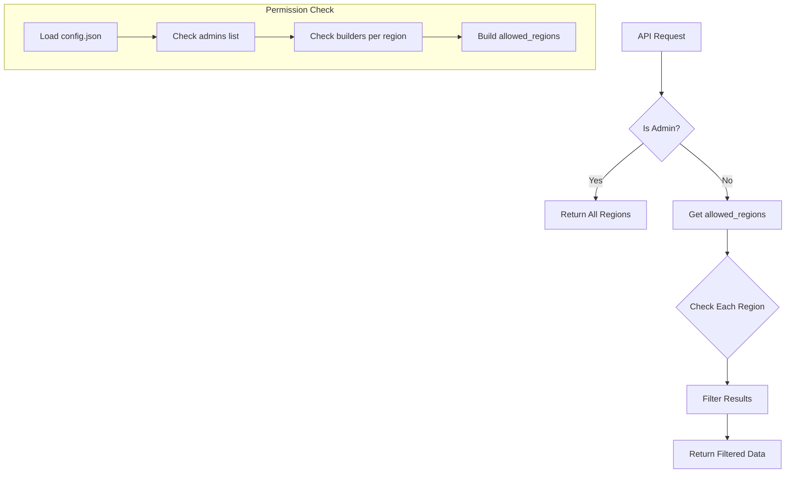

## Session Lifecycle

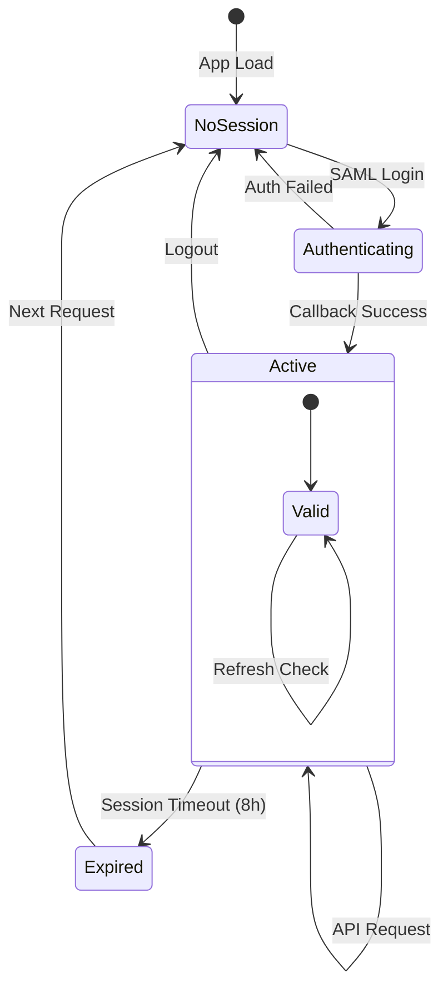

## Data Model Relationships

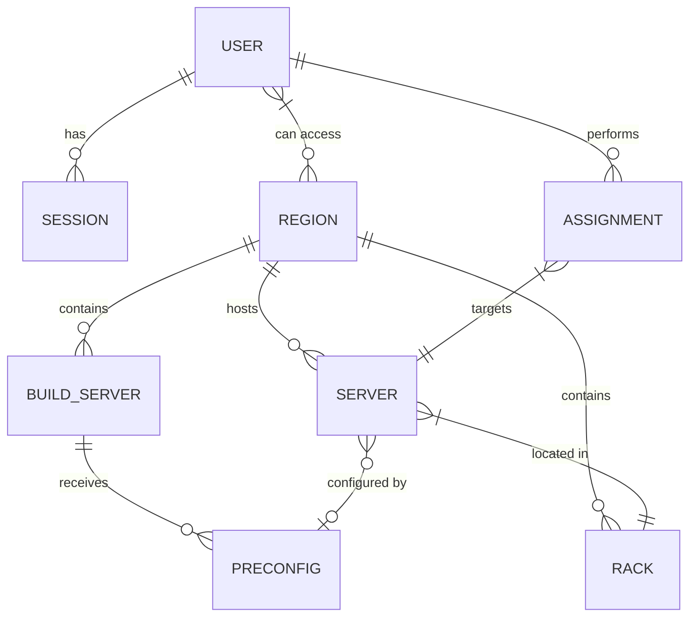

## Error Handling Flow

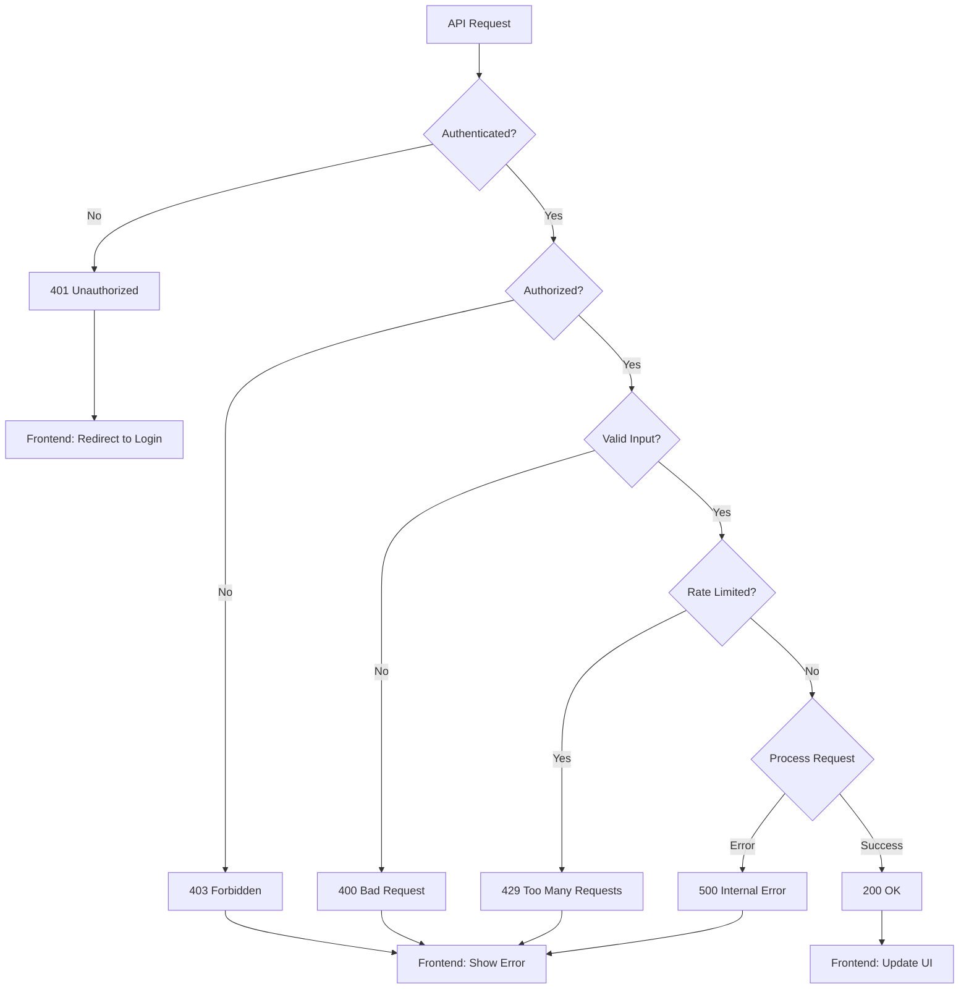

## Next Steps

- [API Reference](../api/README.md) - Detailed endpoint documentation
- [Frontend Architecture](frontend.md) - Component implementation
- [Backend Architecture](backend.md) - Server implementation
