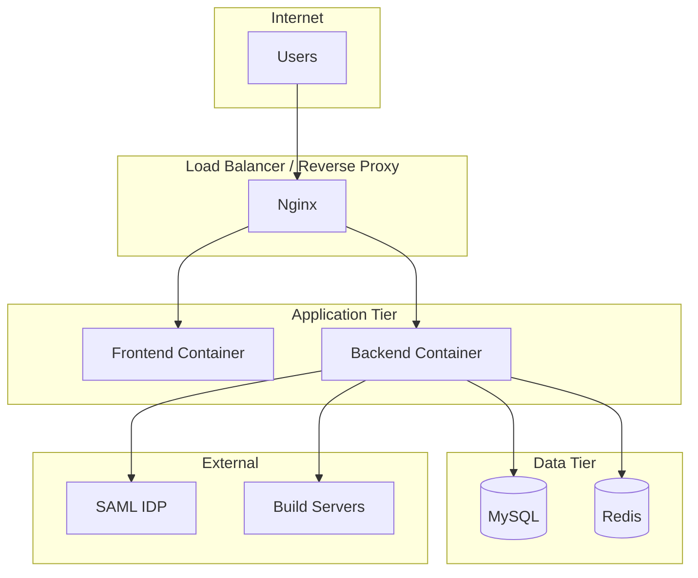

# Deployment Overview

Deployment options and guides for the Server Building Dashboard.

## Quick Navigation

| Guide | Description |
|-------|-------------|
| [Docker](docker.md) | Docker and Docker Compose deployment |
| [Production](production.md) | Production deployment checklist |
| [Nginx](nginx.md) | Nginx reverse proxy configuration |

## Deployment Options

| Option | Best For | Complexity |
|--------|----------|------------|
| Docker Compose | Development, small deployments | Low |
| Docker + Nginx | Production with TLS | Medium |
| Kubernetes | Large scale, high availability | High |

## Architecture Overview



## Quick Start

### Development

```bash
./docker.sh dev start
```

### Production

```bash
./docker.sh prod start
```

## Service Ports

| Service | Default Port | Container Port |
|---------|--------------|----------------|
| Frontend | 8080 | 8080 |
| Backend | 8000 | 8000 |
| MySQL | 3306 | 3306 |

## Resource Requirements

### Minimum (Development)

| Resource | Requirement |
|----------|-------------|
| CPU | 2 cores |
| RAM | 4 GB |
| Disk | 10 GB |

### Recommended (Production)

| Resource | Requirement |
|----------|-------------|
| CPU | 4 cores |
| RAM | 8 GB |
| Disk | 50 GB |

## Container Images

### Frontend

| Stage | Base Image | Purpose |
|-------|------------|---------|
| Build | node:18-alpine | Compile React app |
| Runtime | node:18-alpine + serve | Serve static files |

### Backend

| Stage | Base Image | Purpose |
|-------|------------|---------|
| Build | python:3.11-slim | Install dependencies |
| Runtime | python:3.11-slim | Run FastAPI |

## Security Features

### Container Security

- Non-root users (UID 1000/1001)
- Read-only file systems
- Dropped capabilities
- No new privileges

### Network Security

- Internal Docker network
- Only exposed ports: 8080, 8000
- MySQL not exposed in production

### Application Security

- HTTPS via Nginx
- HTTP-only session cookies
- CORS restrictions
- Rate limiting
- Security headers

## Environment Files

| File | Purpose |
|------|---------|
| `.env` | Frontend and Docker Compose |
| `backend/.env` | Backend configuration |
| `backend/config/config.json` | Regions and permissions |

## Deployment Checklist

Before deploying to production:

- [ ] Generate secure `SECRET_KEY`
- [ ] Configure SAML IDP metadata
- [ ] Set up TLS certificates
- [ ] Configure CORS origins
- [ ] Set up database backups
- [ ] Configure monitoring
- [ ] Review security settings

See [Production Guide](production.md) for detailed checklist.

## Monitoring

### Health Endpoints

| Endpoint | Purpose |
|----------|---------|
| `/api/health` | Backend health check |
| `http://frontend:8080` | Frontend availability |

### Container Health Checks

All containers include health checks in Docker Compose:

```yaml
healthcheck:
  test: ["CMD", "curl", "-f", "http://localhost:8080"]
  interval: 30s
  timeout: 3s
  retries: 3
```

## Logging

### Log Locations

| Service | Location |
|---------|----------|
| Frontend | stdout (Docker logs) |
| Backend | stdout + `/var/log/server-building-dashboard` |
| Nginx | `/var/log/nginx/` |

### Log Aggregation

Consider using:
- ELK Stack (Elasticsearch, Logstash, Kibana)
- Loki + Grafana
- CloudWatch (AWS)

## Backup Strategy

### Database

```bash
# Daily backup
docker exec server-dashboard-mysql mysqldump -u root -p server_dashboard > backup.sql
```

### Configuration

Back up these files:
- `backend/.env`
- `backend/config/config.json`
- `backend/saml_metadata/idp_metadata.xml`

## Scaling

### Current Limitations

- In-memory sessions (single instance)
- In-memory rate limiting (single instance)
- Single Gunicorn worker

### Scaling Path

1. Add Redis for sessions
2. Add Redis for rate limiting
3. Increase Gunicorn workers
4. Add load balancer

## Next Steps

- [Docker Guide](docker.md) - Container deployment
- [Production Guide](production.md) - Production checklist
- [Nginx Guide](nginx.md) - Reverse proxy setup
