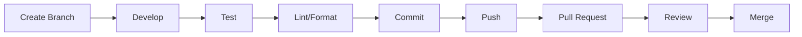

# Development Guide

Developer documentation for the Server Building Dashboard.

## Quick Navigation

| Guide | Description |
|-------|-------------|
| [Frontend Guide](frontend-guide.md) | React/TypeScript development |
| [Backend Guide](backend-guide.md) | FastAPI/Python development |
| [Testing](testing.md) | Testing guide and patterns |
| [Contributing](contributing.md) | Contribution guidelines |

## Development Setup

### Prerequisites

| Tool | Version | Purpose |
|------|---------|---------|
| Node.js | 18+ | Frontend runtime |
| Python | 3.11+ | Backend runtime |
| Docker | 20.10+ | Container runtime |
| Git | 2.0+ | Version control |

### Quick Start

```bash
# Clone repository
git clone <repository-url>
cd server-building-dashboard

# Option 1: Docker (easiest)
cp .env.example .env
cd backend && cp .env.example .env && cd ..
./docker.sh dev start

# Option 2: Local development
npm install
npm run dev  # Terminal 1

cd backend
./setup_script.sh
uvicorn main:app --reload  # Terminal 2
```

## Project Structure

```
server-building-dashboard/
├── src/                    # Frontend source
│   ├── components/         # React components
│   ├── pages/              # Page components
│   ├── hooks/              # Custom hooks
│   ├── contexts/           # React contexts
│   ├── types/              # TypeScript types
│   └── utils/              # Utilities
├── backend/                # Backend source
│   ├── app/                # Application code
│   │   ├── routers/        # API endpoints
│   │   ├── auth.py         # Authentication
│   │   ├── models.py       # Pydantic models
│   │   └── middleware.py   # Middleware
│   ├── tests/              # Test suite
│   └── main.py             # Entry point
├── docs/                   # Documentation
└── public/                 # Static assets
```

## Development Modes

### Dev Mode (Frontend)

Set `VITE_DEV_MODE=true` in `.env`:

- Bypass SAML authentication
- Use mock data when backend unavailable
- Yellow indicator in UI

### Hot Reload

| Component | Command | Port |
|-----------|---------|------|
| Frontend | `npm run dev` | 5173 |
| Backend | `uvicorn main:app --reload` | 8000 |

## Code Style

### Frontend

| Tool | Purpose |
|------|---------|
| TypeScript | Type safety |
| ESLint | Linting |
| Prettier | Formatting (optional) |

```bash
npm run lint
npm run typecheck
```

### Backend

| Tool | Purpose |
|------|---------|
| Black | Formatting |
| Ruff | Linting |
| MyPy | Type checking (optional) |

```bash
black .
ruff check .
```

## Workflow

### Feature Development



### Branch Naming

| Type | Format | Example |
|------|--------|---------|
| Feature | `feature/description` | `feature/add-search` |
| Bug Fix | `fix/description` | `fix/login-redirect` |
| Docs | `docs/description` | `docs/api-reference` |

## Testing

### Frontend

Currently no automated tests. Consider adding:
- Jest for unit tests
- React Testing Library for component tests
- Cypress for E2E tests

### Backend

```bash
# Run all tests
docker run --rm \
  -v "$(pwd)/tests:/app/tests:ro" \
  server-dashboard-backend-test:latest \
  pytest -v

# With coverage
pytest -v --cov=app --cov=main
```

## Debugging

### Frontend

```javascript
// React Developer Tools
// Browser console
console.log('Debug:', value);

// Component state
const [debug, setDebug] = useState(true);
```

### Backend

```python
# Print debugging
print(f"Debug: {value}")

# Logging
import logging
logger = logging.getLogger(__name__)
logger.debug(f"Debug: {value}")

# Set LOG_LEVEL=DEBUG in .env
```

## Common Tasks

### Add Frontend Component

1. Create file in `src/components/`
2. Export as default
3. Import in parent component

### Add API Endpoint

1. Create/update router in `backend/app/routers/`
2. Define Pydantic models
3. Add tests
4. Include router in `main.py`

### Add API Hook

1. Create file in `src/hooks/`
2. Use `fetchWithFallback` for dev mode support
3. Add mock data for testing
4. Use in components

## Environment Variables

### Frontend (.env)

| Variable | Development | Production |
|----------|-------------|------------|
| VITE_DEV_MODE | true | false |
| VITE_BACKEND_URL | http://localhost:8000 | https://api.example.com |

### Backend (backend/.env)

| Variable | Development | Production |
|----------|-------------|------------|
| ENVIRONMENT | dev | prod |
| LOG_LEVEL | DEBUG | INFO |
| DATABASE_URL | (empty for mock) | mysql://... |

## IDE Setup

### VS Code

Recommended extensions:
- ESLint
- TypeScript
- Tailwind CSS IntelliSense
- Python
- Pylance

```json
// .vscode/settings.json
{
  "editor.formatOnSave": true,
  "python.formatting.provider": "black",
  "typescript.preferences.importModuleSpecifier": "relative"
}
```

### PyCharm

- Enable Python interpreter for backend
- Configure pytest as test runner
- Enable Black formatter

## Documentation

When making changes, update relevant documentation:

| Change | Update |
|--------|--------|
| API endpoint | `docs/api/` |
| Frontend feature | `docs/features/`, `docs/architecture/frontend.md` |
| Backend logic | `docs/architecture/backend.md` |
| Configuration | `docs/getting-started/configuration.md` |
| Deployment | `docs/deployment/` |

## Getting Help

- Check existing documentation
- Search codebase for examples
- Ask in team channel
- Open an issue

## Next Steps

- [Frontend Guide](frontend-guide.md) - React development
- [Backend Guide](backend-guide.md) - FastAPI development
- [Testing](testing.md) - Testing guide
- [Contributing](contributing.md) - How to contribute
