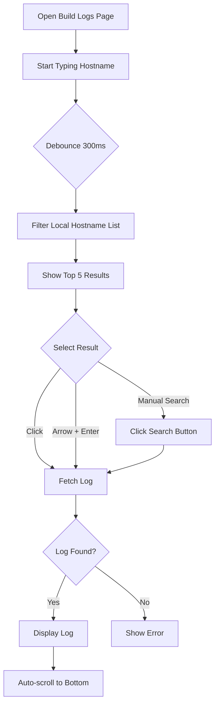

# Build Logs

Search and view detailed server build logs.

## Overview

The Build Logs page provides a searchable interface to find and view installation logs for any server.

## Accessing the Feature

1. Login to the dashboard
2. Click "Build Logs" in the sidebar (or navigate to `/build-logs`)
3. Search for a hostname

## Page Layout

```
┌─────────────────────────────────────────────────────────────────────┐
│ Build Logs                                                           │
├─────────────────────────────────────────────────────────────────────┤
│                                                                      │
│ ┌───────────────────────────────────────────────────────────────────┐│
│ │ 🔍 Search hostname...                              [Search]       ││
│ ├───────────────────────────────────────────────────────────────────┤│
│ │   cbg-srv-001      (exact match)                                  ││
│ │   cbg-srv-0012     (starts with)                                  ││
│ │   dub-cbg-srv-001  (contains)                                     ││
│ └───────────────────────────────────────────────────────────────────┘│
│                                                                      │
│ ┌───────────────────────────────────────────────────────────────────┐│
│ │ Build Log: cbg-srv-001                    Build Server: cbg-build-01│
│ ├───────────────────────────────────────────────────────────────────┤│
│ │ [2025-01-01 10:00:00] Starting installation for cbg-srv-001       ││
│ │ [2025-01-01 10:00:01] Initializing hardware...                    ││
│ │ [2025-01-01 10:00:05] Hardware initialized successfully           ││
│ │ [2025-01-01 10:00:10] Downloading base image...                   ││
│ │ [2025-01-01 10:05:30] Base image downloaded (5.2GB)               ││
│ │ [2025-01-01 10:05:35] Partitioning disk...                        ││
│ │ [2025-01-01 10:06:00] Installing operating system...              ││
│ │ [2025-01-01 10:30:00] OS installation complete                    ││
│ │ [2025-01-01 10:30:05] Configuring network...                      ││
│ │ [2025-01-01 10:30:30] Network configured (IP: 192.168.1.100)      ││
│ │ [2025-01-01 10:30:35] Installing packages...                      ││
│ │ [2025-01-01 10:45:00] Package installation complete               ││
│ │ [2025-01-01 10:45:05] Running post-install scripts...             ││
│ │ [2025-01-01 10:50:00] Installation complete                       ││
│ │                                                           ▼        ││
│ └───────────────────────────────────────────────────────────────────┘│
└─────────────────────────────────────────────────────────────────────┘
```

## Features

### Hostname Search

Search with intelligent ranking:

```
🔍 cbg-srv
```

**Results appear as you type (debounced 300ms):**

```
┌────────────────────────────────────────┐
│ cbg-srv-001      ← exact match first   │
│ cbg-srv-002      ← starts with second  │
│ cbg-srv-003                            │
│ test-cbg-srv-x   ← contains last       │
│ cbg-srv-legacy                         │
└────────────────────────────────────────┘
```

**Ranking Priority:**
1. Exact match
2. Starts with query
3. Contains query

**Results limited to top 5.**

### Keyboard Navigation

| Key | Action |
|-----|--------|
| ↓ | Move to next result |
| ↑ | Move to previous result |
| Enter | Select highlighted result |
| Enter (no highlight) | Search manually |
| Escape | Close results dropdown |

### Log Viewer

When a log is found:

- **Header:** Shows hostname and build server
- **Content:** Full log text in monospace font
- **Auto-scroll:** Automatically scrolls to bottom
- **Scrollable:** Scroll up to view earlier entries

### Search Button

Click "Search" to manually search:
- Useful if no autocomplete result matches
- Triggers API call with exact hostname

## Workflow



## Log Content

Logs typically include:

| Phase | Example Entries |
|-------|-----------------|
| Initialization | Hardware detection, BIOS configuration |
| Download | OS image download, package fetch |
| Installation | Disk partitioning, OS install |
| Configuration | Network setup, hostname configuration |
| Post-install | Package installation, service setup |
| Completion | Final validation, status report |

**Example Log Format:**
```
[2025-01-01 10:00:00] Starting installation for cbg-srv-001
[2025-01-01 10:00:01] Initializing hardware...
[2025-01-01 10:00:05] Hardware initialized successfully
[2025-01-01 10:00:10] Downloading base image...
[2025-01-01 10:05:30] Base image downloaded (5.2GB)
...
```

## Error States

### Log Not Found (404)

```
┌───────────────────────────────────────┐
│ ⚠ Log not found                       │
│                                       │
│ No build log exists for:              │
│ hostname: cbg-srv-999                 │
│                                       │
│ The server may not have been built    │
│ yet, or the log may have been         │
│ archived.                             │
└───────────────────────────────────────┘
```

### Invalid Hostname

```
┌───────────────────────────────────────┐
│ ⚠ Invalid hostname format             │
│                                       │
│ Hostname can only contain:            │
│ • Letters (a-z, A-Z)                  │
│ • Numbers (0-9)                       │
│ • Dots, underscores, hyphens          │
└───────────────────────────────────────┘
```

### Log Too Large

```
┌───────────────────────────────────────┐
│ ⚠ Log file too large                  │
│                                       │
│ The log file exceeds the 10MB limit.  │
│ Contact support for assistance.       │
└───────────────────────────────────────┘
```

## API Integration

### Hostname List
- Endpoint: `GET /api/hostnames`
- Hook: `useHostnames()`
- Loaded on page mount for autocomplete

### Log Retrieval
- Endpoint: `GET /api/build-logs/{hostname}`
- Hook: `useBuildLog()`
- Returns plain text content

### Response Headers
- `X-Build-Server`: Name of server where log was found

## Log File Location

Logs are stored on build servers:

```
BUILD_LOGS_DIR/
├── cbg-build-01/
│   └── cbg-srv-001/
│       └── cbg-srv-001-Installer.log
├── cbg-build-02/
│   └── cbg-srv-002/
│       └── cbg-srv-002-Installer.log
└── dub-build-01/
    └── ...
```

The API searches all build server directories to find the log.

## Tips

1. **Type slowly:** Results appear after 300ms pause
2. **Use arrow keys:** Faster than clicking results
3. **Check build server:** Header shows which server has the log
4. **Scroll up:** Log auto-scrolls to end, scroll up for start

## Troubleshooting

### No search results
- Hostname may not exist in system
- Try typing more characters
- Check for typos

### Log not found
- Server may not have built yet
- Log may have been archived
- Check hostname spelling

### Slow autocomplete
- Large hostname list may take time to filter
- Normal with 40,000+ hostnames

### Log content garbled
- File may have encoding issues
- Report to system administrator

## Permissions

| Action | Admin | Operator | User |
|--------|:-----:|:--------:|:----:|
| Search hostnames | ✓ | ✓ | ✓ |
| View logs | ✓ | ✓ | ✓ |

All authenticated users can view build logs. No region-based restrictions apply to log viewing.

## Next Steps

- [Build Overview](build-overview.md) - Monitor active builds
- [API: Logs Endpoints](../api/logs-endpoints.md) - API documentation
- [Troubleshooting](../troubleshooting/common-issues.md) - Common issues
