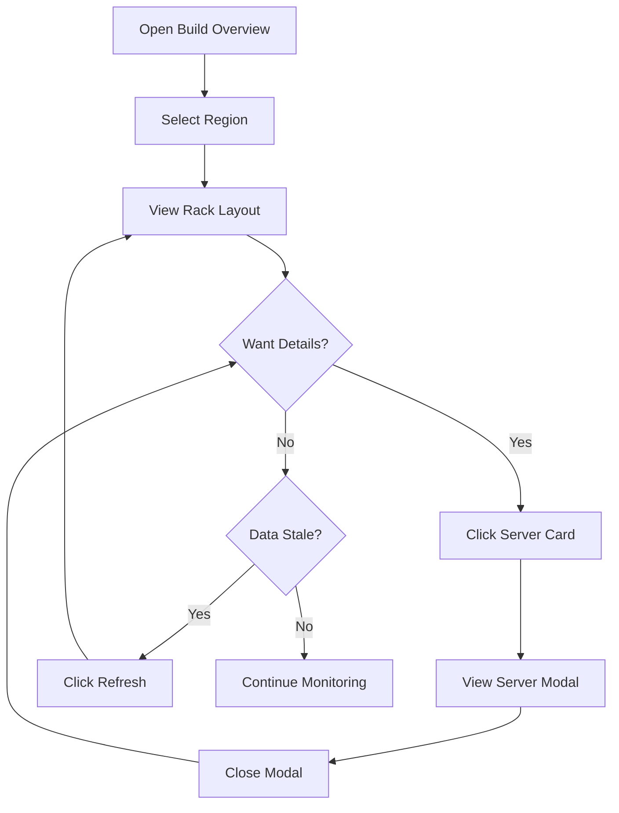

# Build Overview

Real-time monitoring of server builds across all data center regions.

## Overview

The Build Overview page displays servers currently being built, organized by rack, with real-time progress indicators.

## Accessing the Feature

1. Login to the dashboard
2. Click "Build Overview" in the sidebar (or navigate to `/dashboard`)
3. Select a region from the dropdown

## Page Layout

```
┌─────────────────────────────────────────────────────────────────────┐
│ Build Overview                                                       │
├─────────────────────────────────────────────────────────────────────┤
│ Region: [CBG ▼]                    3 servers building    [↻ Refresh]│
├─────────────────────────────────────────────────────────────────────┤
│                                                                      │
│ ┌─────────────────────┐  ┌─────────────────────┐                    │
│ │      Rack 1-A       │  │      Rack 1-B       │                    │
│ ├─────────────────────┤  ├─────────────────────┤                    │
│ │ cbg-srv-001         │  │ cbg-srv-004         │                    │
│ │ [████████████░░░] 65%  │ [██████████████] 100%                    │
│ │ Type: Server        │  │ Type: Server        │                    │
│ │ DBID: 100001        │  │ DBID: 100004        │                    │
│ ├─────────────────────┤  ├─────────────────────┤                    │
│ │ cbg-srv-002         │  │                     │                    │
│ │ [██████████████░] 85%  │                     │                    │
│ │ Type: Server        │  │                     │                    │
│ │ DBID: 100002        │  │                     │                    │
│ └─────────────────────┘  └─────────────────────┘                    │
│                                                                      │
│ ┌─────────────────────┐                                             │
│ │    Small Rack S1    │                                             │
│ ├─────────────────────┤                                             │
│ │ cbg-srv-010         │                                             │
│ │ [████░░░░░░░░░░░] 25%                                             │
│ │ Type: Appliance     │                                             │
│ └─────────────────────┘                                             │
└─────────────────────────────────────────────────────────────────────┘
```

## Features

### Region Selection

- Dropdown shows regions user has access to
- Admin users see all regions (CBG, DUB, DAL)
- Builder users see only assigned regions
- Selection persists during session

### Server Count

Header shows total number of servers currently building:
```
3 servers building    [↻ Refresh]
```

### Rack Visualization

Servers are grouped by rack:

**Normal Racks:** 1-A, 1-B, 1-C, 1-D, 1-E, 2-A, etc.
**Small Racks:** S1-A, S1-B, S2-A, etc.

Rack sections are displayed separately:
```
┌─────────────────────────────────────┐
│           Normal Racks              │
│  [Rack 1-A] [Rack 1-B] [Rack 1-C]  │
├─────────────────────────────────────┤
│           Small Racks               │
│  [Rack S1-A] [Rack S1-B]           │
└─────────────────────────────────────┘
```

### Progress Bar

Each server shows a progress bar with color coding:

| Color | Status | Meaning |
|-------|--------|---------|
| Blue | 0-99% | Currently building |
| Green | 100% | Build complete |
| Red | Any | Build failed |

### Server Card

Each server card displays:
- Hostname
- Progress bar with percentage
- Machine type
- DBID
- Serial number (on hover)

### Click to View Details

Clicking a server card opens the Server Modal:

```
┌───────────────────────────────────────────────────┐
│ Server Details                              [✕]   │
├───────────────────────────────────────────────────┤
│ Basic Information                                 │
│ ┌───────────────────────────────────────────────┐ │
│ │ Hostname:      cbg-srv-001                    │ │
│ │ DBID:          100001                         │ │
│ │ Serial Number: SN-CBG-001                     │ │
│ │ Rack:          1-A                            │ │
│ │ Type:          Server                         │ │
│ │ Status:        installing                     │ │
│ └───────────────────────────────────────────────┘ │
│                                                   │
│ Installation Progress                             │
│ [████████████████████░░░░░░░░░░] 65%             │
│                                                   │
│ Hardware Specifications                           │
│ ┌───────────────────────────────────────────────┐ │
│ │ CPU:     Intel Xeon Gold 6248R                │ │
│ │ RAM:     128 GB                               │ │
│ │ Storage: 4000 GB                              │ │
│ └───────────────────────────────────────────────┘ │
│                                                   │
│ Network Information                               │
│ ┌───────────────────────────────────────────────┐ │
│ │ IP Address:  192.168.1.100                    │ │
│ │ MAC Address: 00:1A:2B:3C:4D:5E                │ │
│ └───────────────────────────────────────────────┘ │
│                                                   │
│ Timing Information                                │
│ ┌───────────────────────────────────────────────┐ │
│ │ Start Time:  2025-01-01 10:00:00              │ │
│ │ Est. Complete: 2025-01-01 12:00:00            │ │
│ │ Last Heartbeat: 2025-01-01 11:55:00           │ │
│ └───────────────────────────────────────────────┘ │
└───────────────────────────────────────────────────┘
```

### Refresh Button

- Click to reload current build status
- Shows loading spinner during refresh
- Data does not auto-refresh

## Workflow



## API Integration

### Data Source
- Endpoint: `GET /api/build-status`
- Hook: `useBuildStatus()`
- Response: Servers grouped by region

### Server Details
- Endpoint: `GET /api/server-details?hostname=...`
- Hook: `useServerDetails()`
- Triggered when modal opens

## Permissions

| User Type | Can View |
|-----------|----------|
| Admin | All regions |
| Builder | Assigned regions only |
| User | Assigned regions only |

## Status Reference

### Build Status

| Status | Description |
|--------|-------------|
| `installing` | OS installation in progress |
| `complete` | Build finished successfully |
| `failed` | Build encountered an error |

### Assignment Status

| Status | Description |
|--------|-------------|
| `not assigned` | Ready for assignment |
| `assigned` | Assigned to customer |

## Tips

1. **Use keyboard shortcuts:** Press `Esc` to close modals
2. **Check all racks:** Scroll down for small racks section
3. **Monitor progress:** Refresh periodically during active builds
4. **View details:** Click servers for hardware specs and timing

## Troubleshooting

### No servers shown
- Verify correct region is selected
- Check if any builds are in progress
- Try refreshing the page

### Modal not loading
- Check network connectivity
- Verify session is still valid
- Try refreshing and reopening

### Incorrect region access
- Contact admin to update permissions
- Check `config.json` permissions section

## Next Steps

- [Server Assignment](server-assignment.md) - Assign completed servers
- [Build Logs](build-logs.md) - View build logs
- [API: Build Endpoints](../api/build-endpoints.md) - API documentation
