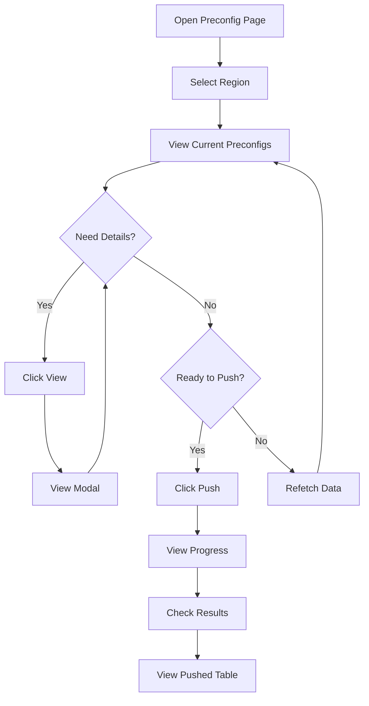
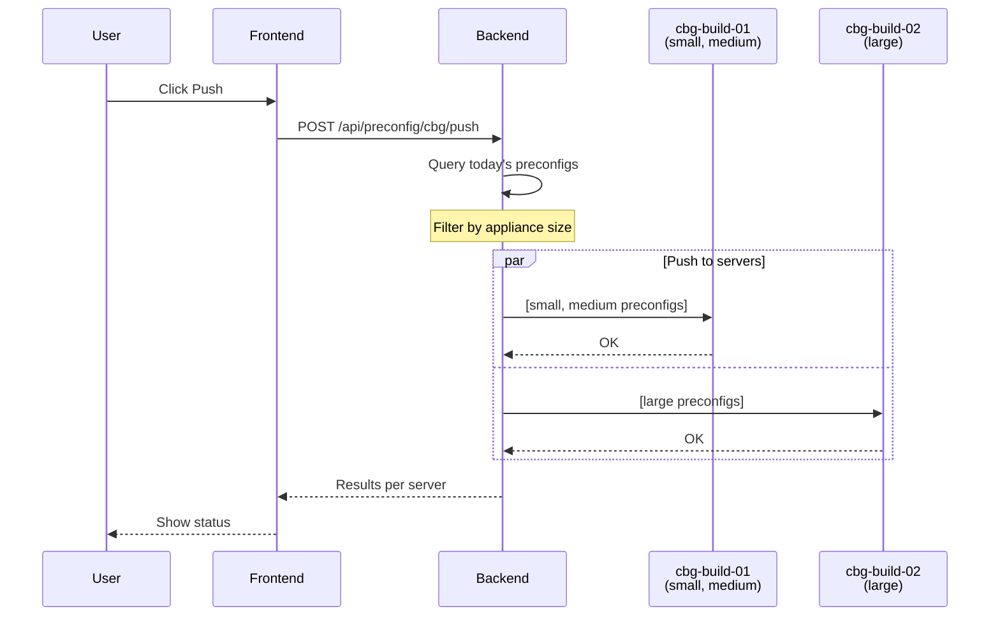

# Preconfig Management

Manage server preconfigurations and push them to build servers.

## Overview

The Preconfig page allows you to view, manage, and push server preconfigurations to build servers in each region.

## Accessing the Feature

1. Login to the dashboard
2. Click "Preconfig" in the sidebar (or navigate to `/preconfig`)
3. Select a region from the dropdown

## Page Layout

```
┌─────────────────────────────────────────────────────────────────────┐
│ Preconfig Management                                                 │
├─────────────────────────────────────────────────────────────────────┤
│ Region: [CBG ▼]                                                      │
├─────────────────────────────────────────────────────────────────────┤
│                                                                      │
│ Appliance Size Overview                                              │
│ ┌──────────┐ ┌──────────┐ ┌──────────┐                              │
│ │  Small   │ │  Medium  │ │  Large   │                              │
│ │    3     │ │    2     │ │    1     │                              │
│ └──────────┘ └──────────┘ └──────────┘                              │
│                                                                      │
├─────────────────────────────────────────────────────────────────────┤
│ Current Preconfigs                              [↻ Refetch] [🔍 Search]│
│ ┌───────────────────────────────────────────────────────────────────┐│
│ │ DBID ▲        │ Size    │ Created           │ Actions             ││
│ ├───────────────────────────────────────────────────────────────────┤│
│ │ dbid-001-001  │ small   │ 2025-01-01 10:00  │ [View]              ││
│ │ dbid-001-002  │ small   │ 2025-01-01 10:30  │ [View]              ││
│ │ dbid-001-003  │ medium  │ 2025-01-01 11:00  │ [View]              ││
│ └───────────────────────────────────────────────────────────────────┘│
│                                                                      │
│ [Push to Build Servers]                                              │
│                                                                      │
├─────────────────────────────────────────────────────────────────────┤
│ Pushed Preconfigs                               [↻ Refetch]          │
│ ┌───────────────────────────────────────────────────────────────────┐│
│ │ DBID          │ Size    │ Pushed At         │ Pushed To           ││
│ ├───────────────────────────────────────────────────────────────────┤│
│ │ dbid-001-001  │ small   │ 2025-01-01 12:00  │ cbg-build-01        ││
│ │ dbid-001-002  │ medium  │ 2025-01-01 12:00  │ cbg-build-01,       ││
│ │               │         │                    │ cbg-build-02        ││
│ └───────────────────────────────────────────────────────────────────┘│
└─────────────────────────────────────────────────────────────────────┘
```

## Features

### Appliance Size Overview

Cards showing preconfig counts by size:

```
┌──────────┐ ┌──────────┐ ┌──────────┐
│  Small   │ │  Medium  │ │  Large   │
│    3     │ │    2     │ │    1     │
└──────────┘ └──────────┘ └──────────┘
```

### Current Preconfigs Table

Displays preconfigs created today for the selected region:

| Column | Description | Sortable |
|--------|-------------|:--------:|
| DBID | Preconfig identifier | ✓ |
| Size | Appliance size (small/medium/large) | ✓ |
| Created | Creation timestamp | ✓ |
| Actions | View details button | - |

**Sorting:**
- Click column header to sort
- Click again to reverse direction
- Arrow indicates current sort

**Filtering:**
- Use search box to filter by DBID
- Real-time filtering as you type

### View Preconfig Details

Click "View" to open the Preconfig Modal:

```
┌───────────────────────────────────────────────────┐
│ Preconfig Details                           [✕]   │
├───────────────────────────────────────────────────┤
│ Basic Information                                 │
│ ┌───────────────────────────────────────────────┐ │
│ │ DBID:      dbid-001-001                       │ │
│ │ Size:      small                              │ │
│ │ Region:    CBG                                │ │
│ │ Depot:     1                                  │ │
│ └───────────────────────────────────────────────┘ │
│                                                   │
│ Timestamps                                        │
│ ┌───────────────────────────────────────────────┐ │
│ │ Created:   2025-01-01 10:00:00                │ │
│ │ Pushed:    2025-01-01 12:00:00                │ │
│ └───────────────────────────────────────────────┘ │
│                                                   │
│ Configuration                                     │
│ ┌───────────────────────────────────────────────┐ │
│ │ {                                             │ │
│ │   "os": "Ubuntu 22.04 LTS",                   │ │
│ │   "cpu": "2x Intel Xeon Gold 6248R",          │ │
│ │   "ram": "128GB DDR4",                        │ │
│ │   "storage": "4x 1TB NVMe SSD",               │ │
│ │   "raid": "RAID 10",                          │ │
│ │   "network": "2x 25Gbps"                      │ │
│ │ }                                             │ │
│ └───────────────────────────────────────────────┘ │
└───────────────────────────────────────────────────┘
```

### Push to Build Servers

Push current preconfigs to all build servers in the region:

1. Click "Push to Build Servers"
2. View per-server progress
3. See success/failure status for each server

**Push Progress UI:**

```
┌───────────────────────────────────────────────────┐
│ Push Progress                                     │
├───────────────────────────────────────────────────┤
│ cbg-build-01:  ✓ Success (3 preconfigs)          │
│ cbg-build-02:  ✓ Success (2 preconfigs)          │
├───────────────────────────────────────────────────┤
│ Overall: Success - Pushed to 2 build server(s)   │
└───────────────────────────────────────────────────┘
```

**Status Indicators:**

| Icon | Status | Meaning |
|------|--------|---------|
| ⏳ | Loading | Push in progress |
| ✓ | Success | Preconfigs pushed successfully |
| ✗ | Failed | Push failed (see error) |
| ⊘ | Skipped | No matching preconfigs for server |

### Pushed Preconfigs Table

Shows preconfigs that have been pushed:

| Column | Description |
|--------|-------------|
| DBID | Preconfig identifier |
| Size | Appliance size |
| Pushed At | Last push timestamp |
| Pushed To | Build servers that received the preconfig |

## Workflow



## Push Logic

The push process filters preconfigs by build server capability:



## API Integration

### Current Preconfigs
- Endpoint: `GET /api/preconfig/{region}`
- Hook: `usePreconfigs(region)`
- Returns preconfigs for today

### Push Operation
- Endpoint: `POST /api/preconfig/{region}/push`
- Hook: `usePushPreconfig()`
- Returns per-server results

### Pushed Preconfigs
- Endpoint: `GET /api/preconfig/pushed`
- Hook: `usePushedPreconfigs()`
- Returns preconfigs with push history

## Permissions

| Action | Admin | Operator | User |
|--------|:-----:|:--------:|:----:|
| View preconfigs | ✓ | ✓ | ✓ |
| View details | ✓ | ✓ | ✓ |
| Push preconfigs | ✓ | ✓ | - |

## Appliance Sizes

| Size | Typical Configuration |
|------|----------------------|
| Small | 2 CPU, 128GB RAM, 4TB storage |
| Medium | 4 CPU, 256GB RAM, 8TB storage |
| Large | 8 CPU, 512GB RAM, 16TB storage |

## Build Server Configuration

Build servers are configured in `config.json`:

```json
{
  "regions": {
    "cbg": {
      "build_servers": {
        "cbg-build-01": {
          "preconfigs": ["small", "medium"]
        },
        "cbg-build-02": {
          "preconfigs": ["large"]
        }
      }
    }
  }
}
```

## Tips

1. **Check counts:** Review appliance size cards before pushing
2. **View config:** Click "View" to verify configuration details
3. **Monitor results:** Watch per-server status during push
4. **Refetch after push:** Click refetch to see updated pushed table

## Troubleshooting

### Push fails for all servers
- Check build server connectivity
- Verify build server domain configuration
- Check backend logs for errors

### Push shows "skipped"
- Server's preconfigs list doesn't match any available sizes
- Check build server configuration

### No preconfigs shown
- Verify preconfigs were created today
- Check correct region is selected
- Try refetching data

### Permission denied
- User role doesn't allow pushing
- Contact admin for operator access

## Next Steps

- [Server Assignment](server-assignment.md) - Assign servers after build
- [API: Preconfig Endpoints](../api/preconfig-endpoints.md) - API documentation
- [Configuration](../getting-started/configuration.md) - Build server setup
