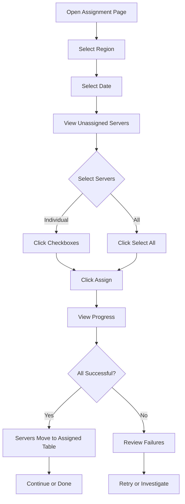
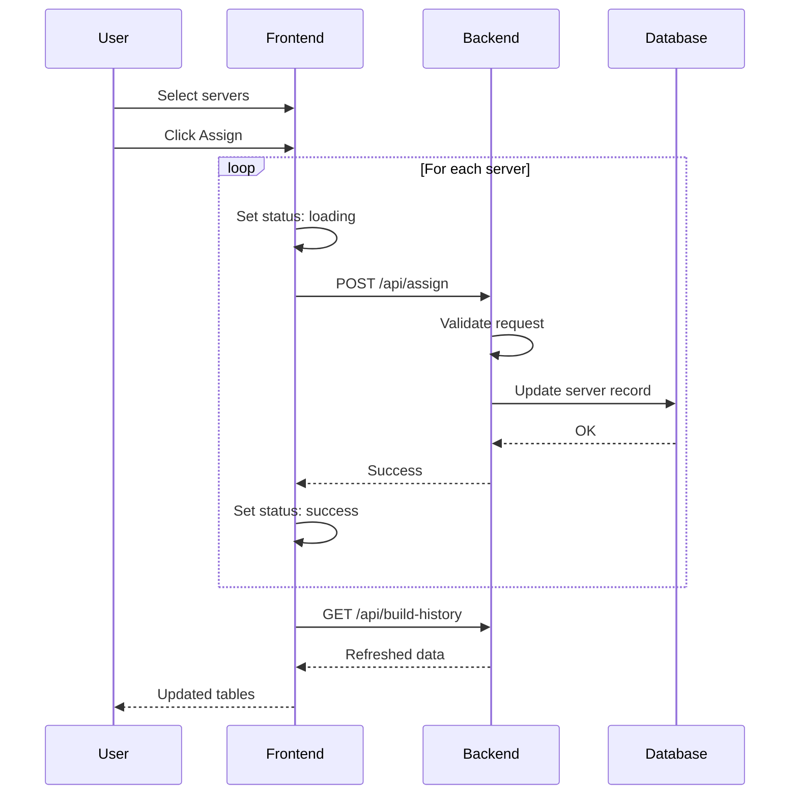

# Server Assignment

Assign completed servers to customers with tracking and audit trail.

## Overview

The Assignment page allows operators to assign completed servers to customers, with full tracking of who assigned each server and when.

## Accessing the Feature

1. Login to the dashboard
2. Click "Assign" in the sidebar (or navigate to `/assign`)
3. Select a region and date

## Page Layout

```
┌─────────────────────────────────────────────────────────────────────┐
│ Server Assignment                                                    │
├─────────────────────────────────────────────────────────────────────┤
│ Region: [CBG ▼]          Date: [2025-01-01 📅]       [↻ Refresh]    │
├─────────────────────────────────────────────────────────────────────┤
│                                                                      │
│ Available to Assign                          [Select All] [Deselect]│
│ ┌───────────────────────────────────────────────────────────────────┐│
│ │ ☐ │ Rack ▲  │ Hostname      │ DBID      │ Serial Number         ││
│ ├───────────────────────────────────────────────────────────────────┤│
│ │ ☐ │ 1-A     │ cbg-srv-001   │ 100001    │ SN-CBG-001            ││
│ │ ☐ │ 1-B     │ cbg-srv-002   │ 100002    │ SN-CBG-002            ││
│ │ ☐ │ 1-B     │ cbg-srv-003   │ 100003    │ SN-CBG-003            ││
│ └───────────────────────────────────────────────────────────────────┘│
│                                                                      │
│ [Assign Selected (0)]                                                │
│                                                                      │
├─────────────────────────────────────────────────────────────────────┤
│ Already Assigned                                                     │
│ ┌───────────────────────────────────────────────────────────────────┐│
│ │ Rack    │ Hostname      │ DBID      │ Assigned By    │ When      ││
│ ├───────────────────────────────────────────────────────────────────┤│
│ │ 1-C     │ cbg-srv-004   │ 100004    │ user@example   │ 11:30 AM  ││
│ │ 1-D     │ cbg-srv-005   │ 100005    │ admin@example  │ 11:45 AM  ││
│ └───────────────────────────────────────────────────────────────────┘│
└─────────────────────────────────────────────────────────────────────┘
```

## Features

### Region and Date Selection

- **Region dropdown:** Shows regions user has access to
- **Date picker:** Select date for historical builds
- **Today default:** Opens with current date

### Available to Assign Table

Servers that are complete but not yet assigned:

| Column | Description | Sortable |
|--------|-------------|:--------:|
| Checkbox | Select for assignment | - |
| Rack | Rack identifier | ✓ |
| Hostname | Server hostname | ✓ |
| DBID | Database identifier | ✓ |
| Serial Number | Hardware serial | ✓ |

**Sorting:**
- Click column header to sort
- Rack IDs sorted numerically (1-A before 1-B, 1-E before 2-A)
- Click again to reverse

**Selection:**
- Click checkbox to select individual servers
- Use "Select All" for all unassigned
- Use "Deselect" to clear selection

### Assignment Button

Shows count of selected servers:

```
[Assign Selected (3)]
```

When clicked:
- Processes servers sequentially
- Shows per-server status
- Auto-refreshes data on completion

### Assignment Progress

During assignment, individual statuses appear:

```
┌───────────────────────────────────────────┐
│ cbg-srv-001: ⏳ Assigning...              │
│ cbg-srv-002: ✓ Assigned                   │
│ cbg-srv-003: ✗ Failed - Access denied     │
└───────────────────────────────────────────┘
```

### Already Assigned Table

Read-only table showing assigned servers:

| Column | Description |
|--------|-------------|
| Rack | Rack identifier |
| Hostname | Server hostname |
| DBID | Database identifier |
| Assigned By | Email of person who assigned |
| When | Assignment time |

## Workflow



## Assignment Process



## Assignment Record

When a server is assigned, the following is recorded:

| Field | Value |
|-------|-------|
| `assigned_status` | "assigned" |
| `assigned_by` | User's email address |
| `assigned_at` | Current timestamp |

## API Integration

### Build History
- Endpoint: `GET /api/build-history/{region}/{date}`
- Hook: `useBuildHistory()`
- Returns servers for the selected date

### Assignment
- Endpoint: `POST /api/assign`
- Hook: `useAssignServers()`
- Sends: `{ serial_number, hostname, dbid }`

## Permissions

| Action | Admin | Operator | User |
|--------|:-----:|:--------:|:----:|
| View unassigned | ✓ | ✓ | ✓ |
| View assigned | ✓ | ✓ | ✓ |
| Assign servers | ✓ | ✓ | - |

## Status Reference

### Server Status

| Status | Can Assign |
|--------|:----------:|
| complete | ✓ |
| installing | - |
| failed | - |

### Assignment Status

| Status | Meaning |
|--------|---------|
| not assigned | Available for assignment |
| assigned | Already assigned |

## Tips

1. **Bulk select:** Use "Select All" for large batches
2. **Check date:** Ensure correct date is selected
3. **Review failures:** Check error messages for failed assignments
4. **Verify region:** Confirm you're in the correct region

## Keyboard Shortcuts

| Key | Action |
|-----|--------|
| Space | Toggle checkbox when focused |
| Enter | Submit form/confirm action |

## Troubleshooting

### No servers available
- Check date is correct (servers from selected date only)
- Verify region has completed builds
- All servers may already be assigned

### Assignment fails
- Check user has permission for region
- Verify server still exists
- Review error message

### Permission denied
- User role may not allow assignments
- Contact admin for operator access

### Servers still showing after assignment
- Click refresh button
- Check network connectivity
- Verify assignment succeeded in assigned table

## Audit Trail

All assignments are logged with:
- **Who:** User's email address
- **What:** Server DBID and hostname
- **When:** Timestamp
- **Where:** Region/depot

This enables:
- Tracking who assigned each server
- Historical assignment reports
- Accountability and compliance

## Next Steps

- [Build Logs](build-logs.md) - View server build logs
- [Build Overview](build-overview.md) - Monitor active builds
- [API: Server Endpoints](../api/server-endpoints.md) - API documentation
