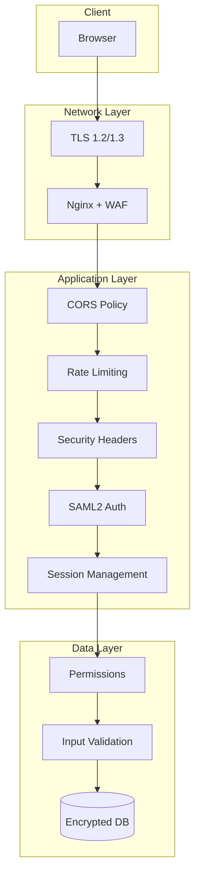
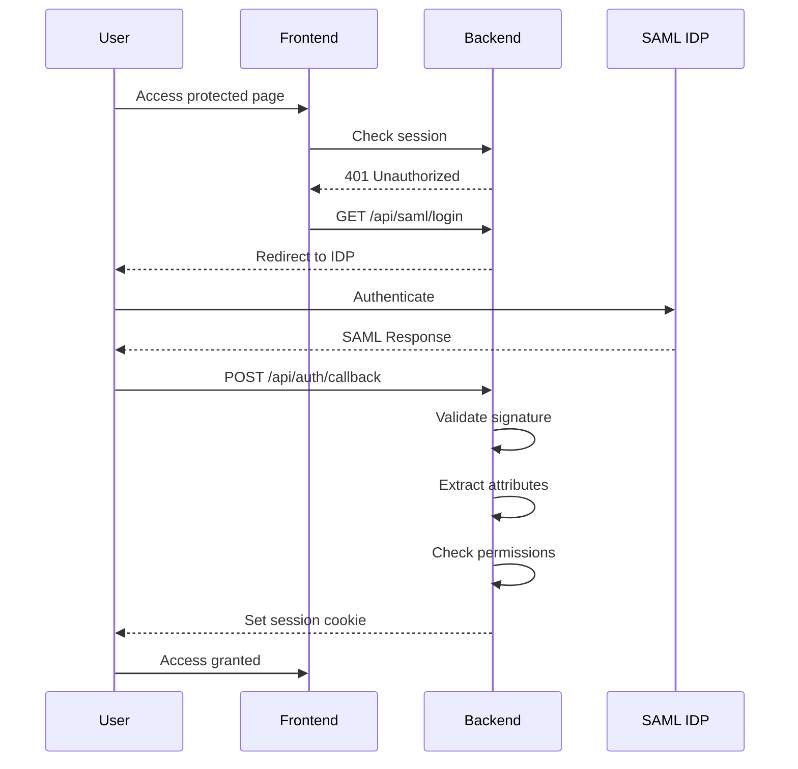

# Security Overview

Security architecture and guidelines for the Server Building Dashboard.

## Quick Navigation

| Guide | Description |
|-------|-------------|
| [Authentication](authentication.md) | SAML2 configuration and setup |
| [Permissions](permissions.md) | Region-based access control |
| [Best Practices](best-practices.md) | Security hardening guide |

## Security Architecture



## Security Layers

### 1. Transport Security

| Feature | Implementation |
|---------|----------------|
| TLS | 1.2 and 1.3 only |
| Cipher Suites | Modern ECDHE, ChaCha20 |
| HSTS | max-age=63072000 |
| Certificate | Let's Encrypt or commercial |

### 2. Authentication

| Feature | Implementation |
|---------|----------------|
| Protocol | SAML 2.0 |
| Identity Provider | Azure AD, ADFS, etc. |
| Session Storage | HTTP-only cookies |
| Session Duration | 8 hours (configurable) |

### 3. Authorization

| Feature | Implementation |
|---------|----------------|
| Model | Role-based (RBAC) |
| Granularity | Region-level |
| Roles | Admin, Operator, User |
| Configuration | config.json |

### 4. Application Security

| Feature | Implementation |
|---------|----------------|
| CORS | Strict origin whitelist |
| Rate Limiting | 60/min sustained, 100 burst |
| Input Validation | Pydantic models |
| Path Traversal | Resolved path validation |

### 5. Security Headers

| Header | Value |
|--------|-------|
| X-Content-Type-Options | nosniff |
| X-Frame-Options | DENY |
| X-XSS-Protection | 1; mode=block |
| Content-Security-Policy | Strict policy |
| Referrer-Policy | strict-origin-when-cross-origin |
| Permissions-Policy | Disabled features |

## Threat Model

### Threats Mitigated

| Threat | Mitigation |
|--------|------------|
| Man-in-the-Middle | TLS encryption |
| Session Hijacking | HTTP-only cookies, Secure flag |
| Cross-Site Scripting (XSS) | CSP, input validation |
| Cross-Site Request Forgery | SameSite cookies |
| Clickjacking | X-Frame-Options |
| Brute Force | Rate limiting |
| Path Traversal | Input validation, path resolution |
| SQL Injection | Parameterized queries (SQLAlchemy) |

### Attack Surface

| Component | Exposure | Controls |
|-----------|----------|----------|
| Frontend | Public | CSP, input sanitization |
| Backend API | Public | Auth, rate limiting, validation |
| Database | Internal only | Network isolation, encryption |
| Build Servers | Internal only | VPN/private network |

## Authentication Flow



## Session Security

### Cookie Configuration

```python
response.set_cookie(
    key="session_token",
    value=token,
    httponly=True,      # No JavaScript access
    secure=True,        # HTTPS only
    samesite="Lax",     # CSRF protection
    max_age=28800,      # 8 hours
    path="/"
)
```

### Session Storage

Current: In-memory (single instance)
Recommended: Redis with encryption

## Input Validation

### Hostname Pattern

```python
HOSTNAME_PATTERN = r"^[a-zA-Z0-9._-]+$"
```

Prevents path traversal and injection.

### Pydantic Models

```python
class AssignRequest(BaseModel):
    serial_number: str
    hostname: str
    dbid: str

# Automatic validation on request
@router.post("/assign")
async def assign(request: AssignRequest):
    # request is guaranteed to be valid
    ...
```

## Secrets Management

### Required Secrets

| Secret | Purpose | Generation |
|--------|---------|------------|
| SECRET_KEY | Session encryption | `secrets.token_urlsafe(32)` |
| MYSQL_PASSWORD | Database access | Strong random password |
| SAML Certificate | IDP trust | From IDP |

### Storage Recommendations

| Environment | Method |
|-------------|--------|
| Development | .env file (gitignored) |
| Production | Docker secrets, Vault, AWS SSM |

## Compliance Considerations

### Data Protection

- Session data is ephemeral
- No PII stored in logs
- Database access is audited
- Passwords are never stored

### Audit Trail

- All assignments logged with user email
- Correlation IDs for request tracing
- Timestamps on all operations

## Security Checklist

### Before Production

- [ ] Generate unique SECRET_KEY
- [ ] Configure SAML with production URLs
- [ ] Enable TLS with valid certificates
- [ ] Restrict CORS origins
- [ ] Disable API docs
- [ ] Review rate limits
- [ ] Set up monitoring and alerting
- [ ] Test authentication flow
- [ ] Review permission configuration

### Ongoing

- [ ] Monitor for failed login attempts
- [ ] Review access logs regularly
- [ ] Keep dependencies updated
- [ ] Rotate secrets periodically
- [ ] Test disaster recovery
- [ ] Conduct security reviews

## Vulnerability Reporting

If you discover a security vulnerability:

1. Do not open a public issue
2. Email security team privately
3. Include detailed reproduction steps
4. Allow time for remediation

## Next Steps

- [Authentication](authentication.md) - SAML2 setup
- [Permissions](permissions.md) - Access control
- [Best Practices](best-practices.md) - Security hardening
