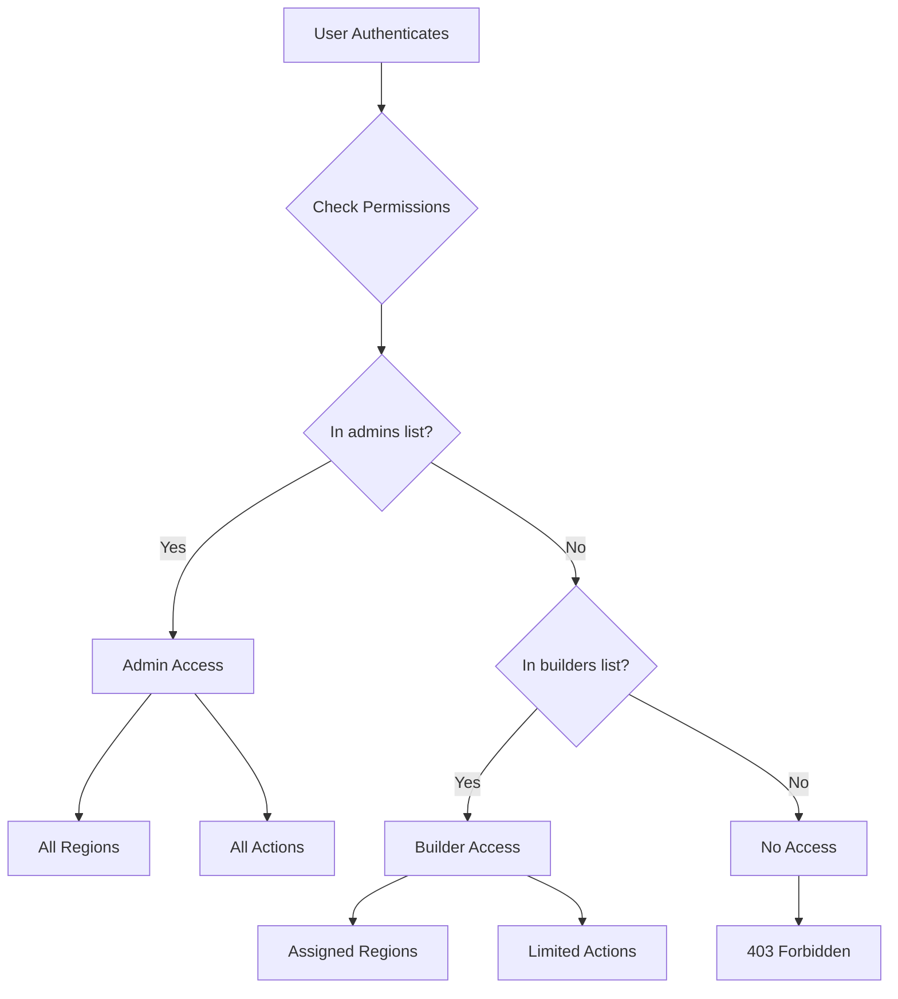

# Permissions System

Region-based access control for the Server Building Dashboard.

## Overview

The permission system controls:
- Which regions users can access
- What actions users can perform
- Admin privileges

## Permission Model



## Configuration

### config.json Structure

```json
{
  "permissions": {
    "admins": [
      "admin@example.com",
      "super.user@example.com"
    ],
    "builders": {
      "cbg": [
        "cambridge-team@example.com",
        "builder1@example.com"
      ],
      "dub": [
        "dublin-ops@example.com"
      ],
      "dal": [
        "dallas-team@example.com",
        "builder2@example.com"
      ]
    }
  }
}
```

### File Location

```
backend/
└── config/
    └── config.json
```

## User Roles

### Admin

Users in the `admins` list have:

| Permission | Granted |
|------------|:-------:|
| Access all regions | ✓ |
| View all builds | ✓ |
| View all preconfigs | ✓ |
| Push preconfigs | ✓ |
| Assign servers | ✓ |
| View all logs | ✓ |

### Builder

Users in any `builders.{region}` list have:

| Permission | Granted |
|------------|:-------:|
| Access assigned regions | ✓ |
| View builds in assigned regions | ✓ |
| View preconfigs in assigned regions | ✓ |
| Push preconfigs (operators only) | Varies |
| Assign servers (operators only) | Varies |
| View logs | ✓ |

### No Access

Users not in any list:
- Cannot access the dashboard
- Receive 403 Forbidden after SAML login

## Permission Checks

### During Login

```python
def get_current_user(request: Request) -> User:
    # ... validate session ...

    # Check user has access
    is_admin, allowed_regions = get_user_permissions(email)

    if not is_admin and not allowed_regions:
        raise HTTPException(403, "User not authorized")

    return User(
        email=email,
        is_admin=is_admin,
        allowed_regions=allowed_regions
    )
```

### On API Requests

```python
@router.get("/api/build-status")
async def get_build_status(user: User = Depends(get_current_user)):
    # Filter by user's regions
    if user.is_admin:
        return all_builds
    else:
        return {r: builds for r, builds in all_builds.items()
                if r in user.allowed_regions}
```

### Region-Specific Endpoints

```python
@router.get("/api/preconfig/{region}")
async def get_preconfigs(region: str, user: User = Depends(get_current_user)):
    # Check region access
    if not user.is_admin and region not in user.allowed_regions:
        raise HTTPException(403, "Access denied to this region")

    return preconfigs
```

## Permission Functions

### get_user_permissions

```python
def get_user_permissions(email: str) -> Tuple[bool, List[str]]:
    """
    Returns (is_admin, allowed_regions)
    """
    config = get_config()
    email_lower = email.lower()

    # Check admin list
    admins = [a.lower() for a in config["permissions"]["admins"]]
    if email_lower in admins:
        return (True, list(config["regions"].keys()))

    # Check builder lists
    allowed = []
    for region, builders in config["permissions"]["builders"].items():
        if email_lower in [b.lower() for b in builders]:
            allowed.append(region)

    return (False, allowed)
```

### check_region_access

```python
def check_region_access(email: str, region: str) -> bool:
    """Check if user can access specific region"""
    is_admin, allowed = get_user_permissions(email)
    return is_admin or region in allowed
```

### check_depot_access

```python
def check_depot_access(email: str, depot: int) -> bool:
    """Check access by depot ID"""
    region = get_region_for_depot(depot)
    if region is None:
        return False
    return check_region_access(email, region)
```

## Region-Depot Mapping

| Region | Depot ID |
|--------|----------|
| cbg | 1 |
| dub | 2 |
| dal | 4 |

Used for preconfig access control.

## SAML Role Integration

SAML groups are used for role determination, not region access:

```python
def _determine_role(groups: List[str]) -> str:
    """Determine role from SAML groups"""
    if any(g in ADMIN_GROUPS for g in groups):
        return "admin"
    elif any(g in OPERATOR_GROUPS for g in groups):
        return "operator"
    else:
        return "user"
```

Role affects action permissions (see below).

## Action Permissions

| Action | Admin | Operator | User |
|--------|:-----:|:--------:|:----:|
| View builds | ✓ | ✓ | ✓ |
| View preconfigs | ✓ | ✓ | ✓ |
| Push preconfigs | ✓ | ✓ | - |
| Assign servers | ✓ | ✓ | - |
| View logs | ✓ | ✓ | ✓ |

Note: Region access still applies to all actions.

## Multi-Region Access

Users can be added to multiple region lists:

```json
{
  "builders": {
    "cbg": ["multi-region@example.com"],
    "dub": ["multi-region@example.com"]
  }
}
```

This user can access both CBG and DUB.

## Wildcard Access

Currently not supported. For all-region access without admin:
1. Add user to all region lists, or
2. Add user to admins list

## Permission Changes

### Adding a User

```json
{
  "builders": {
    "cbg": [
      "existing@example.com",
      "new-user@example.com"  // Add here
    ]
  }
}
```

### Removing a User

Remove from all lists where they appear.

### Promoting to Admin

Add to `admins` list:

```json
{
  "admins": [
    "existing-admin@example.com",
    "promoted-user@example.com"  // Add here
  ]
}
```

### Changes Take Effect

- Immediately for new logins
- After session expiration for existing sessions
- No application restart needed

## API Response with Permissions

### GET /api/me

```json
{
  "id": "user@example.com",
  "email": "user@example.com",
  "name": "John Doe",
  "role": "operator",
  "groups": ["Dashboard-Operators"],
  "is_admin": false,
  "allowed_regions": ["cbg", "dub"]
}
```

### Filtered Responses

Build status for non-admin:

```json
{
  "cbg": [...],  // User has access
  "dub": [...]   // User has access
  // dal not included - no access
}
```

## Frontend Permission Handling

### useAuth Hook

```typescript
const { user } = useAuth();

// Check admin status
if (user.is_admin) {
  // Show all regions
}

// Check specific region
if (user.allowed_regions.includes('cbg')) {
  // Show CBG content
}
```

### Conditional UI

```tsx
function RegionSelector() {
  const { user } = useAuth();

  return (
    <select>
      {user.allowed_regions.map(region => (
        <option key={region} value={region}>
          {region.toUpperCase()}
        </option>
      ))}
    </select>
  );
}
```

## Audit Considerations

All actions are logged with:
- User email
- Action performed
- Region/resource
- Timestamp
- Correlation ID

## Troubleshooting

### User has 403 after login

1. Check user email in config.json
2. Verify case-insensitive matching
3. Ensure user is in admins or builders

### User missing expected regions

1. Verify builder lists include user
2. Check for typos in email
3. Verify region codes are correct

### Permission changes not working

1. User may have existing session
2. Wait for session to expire, or
3. User can logout and login again

## Next Steps

- [Authentication](authentication.md) - SAML setup
- [Best Practices](best-practices.md) - Security hardening
- [Configuration](../getting-started/configuration.md) - Full config reference
